## Introduction

This guide provides non-exhaustive recommendations and general best practices to achieve a comprehensive **Layer 7 (L7) / Application Security approach** with Cloudflare.

> _This may be relevant for those seeking similar frameworks, such as [CIS Benchmarks](https://downloads.cisecurity.org/#/)._

Some features mentioned are available only through advanced Cloudflare bundles, such as **WAF Advanced**, [Advanced Rate Limiting](https://developers.cloudflare.com/waf/rate-limiting-rules/#availability), or **Enterprise** features like [Enterprise Bot Management](https://developers.cloudflare.com/bots/plans/bm-subscription/).

This guide assumes that your domain is already onboarded to Cloudflare as a [Zone](https://developers.cloudflare.com/fundamentals/setup/accounts-and-zones/#zones) and configured using [Full Setup](https://developers.cloudflare.com/dns/zone-setups/full-setup/), meaning Cloudflare is acting as your authoritative DNS provider. Additionally, it's recommended to have [DNSSEC](https://developers.cloudflare.com/dns/dnssec/) enabled and being familiar with [Zone Holds](https://developers.cloudflare.com/fundamentals/account/account-security/zone-holds/).

> **You can find all recommendations, security rules and more in the _[Cloudflare L7 Best Practices Repository (Database)](https://db.automatic-demo.com/)_ for quick searches.**

---

## Prerequisite Knowledge

Before implementing any of the recommendations below, it helps to be familiar with a handful of Cloudflare fundamentals. Most _"why did my rule not match?"_ or _"why is this request still reaching my origin?"_ situations trace back to one of the following concepts.

### Order of Execution (Phases)

Cloudflare products do not all run at the same moment. Each product powered by the [Ruleset Engine](https://developers.cloudflare.com/ruleset-engine/) executes within its own [phase](https://developers.cloudflare.com/ruleset-engine/about/phases/), and phases run in a fixed [order of execution](https://developers.cloudflare.com/ruleset-engine/reference/phases-list/).

Practical implications:

- Anything produced in a **later** phase cannot be matched in an **earlier** one. This is exactly why the `CF-Worker` header cannot be used in WAF Custom Rules (see [Mitigate Unauthorized Cloudflare Workers](#mitigate-unauthorized-cloudflare-workers)), and why headers added by [Request Header Transform Rules](https://developers.cloudflare.com/rules/transform/request-header-modification/) are invisible to the WAF.
- A [Skip](https://developers.cloudflare.com/waf/custom-rules/skip/) action only skips the products or phases you explicitly select. It is not a global _"allow everything"_, and it cannot undo a phase that already executed.
- Within a phase, rules are evaluated top to bottom and the first terminating action wins. Order matters: narrow Skip / Allow rules at the top, broader mitigations below.
- **Response** phases (Custom Errors, Managed Transforms, Response Header Transform Rules, Compression Rules, and Rate Limiting Rules that use response information) only run after the origin has responded.

Reference: [Phases list](https://developers.cloudflare.com/ruleset-engine/reference/phases-list/) and [WAF phases](https://developers.cloudflare.com/waf/reference/phases/).

### HTTP/S Network Ports

Cloudflare's proxy only handles a [specific set of HTTP/S ports](https://developers.cloudflare.com/fundamentals/reference/network-ports/): `80`, `8080`, `8880`, `2052`, `2082`, `2086`, `2095` for HTTP, and `443`, `2053`, `2083`, `2087`, `2096`, `8443` for HTTPS. Requests to any other port on a proxied hostname are not handled by Cloudflare's proxy by default. For that you'd require [Spectrum](https://developers.cloudflare.com/spectrum/).

- Caching is disabled on the alternative ports (`2052`, `2053`, `2082`, `2083`, `2086`, `2087`, `2095`, `2096`, `8880`, `8443`), unless an Enterprise [cache rule](https://developers.cloudflare.com/cache/how-to/cache-rules/settings/#caching-on-port-enterprise-only) enables it.
- Only ports `80` and `443` are compatible with the [**China Network**](https://developers.cloudflare.com/china-network/).
- To prevent HTTP/S requests over non-standard ports from ever reaching the origin, enable the _Anomaly:Port - Non Standard Port (not 80 or 443)_ rule described in [Stricter Security Requirements with WAF Managed Ruleset](#stricter-security-requirements-with-waf-managed-ruleset).
- For anything that is not HTTP/S (i.e. SSH, RDP, custom TCP/UDP), use [Spectrum](https://developers.cloudflare.com/spectrum/) rather than [gray-clouding / DNS-Only](https://developers.cloudflare.com/dns/proxy-status/) the DNS record, which would expose the origin IP. See [Non-HTTP/S Use Cases](#non-https-use-cases).
- Because of Cloudflare's [anycast](https://www.cloudflare.com/learning/cdn/glossary/anycast-network/) network, [port scanners](https://developers.cloudflare.com/fundamentals/reference/scans-penetration/#important-remarks) will likely report these non-standard ports as open on [Cloudflare IPs](https://developers.cloudflare.com/fundamentals/concepts/cloudflare-ip-addresses/). That is shared Cloudflare infrastructure serving many customers, not an open port on your origin.

### TCP Connections and Connection Limits

When traffic is proxied, there are two independent [TCP connections](https://developers.cloudflare.com/fundamentals/reference/tcp-connections/): client → Cloudflare, and Cloudflare → origin. Each has its own timeouts and [connection limits](https://developers.cloudflare.com/fundamentals/reference/connection-limits/).

- Client-side connections have a **400 second** idle timeout, after which Cloudflare sends keep-alive probes and eventually severs the connection with a TCP Reset (RST).
- Origin-side timeouts map directly to the [Cloudflare error](https://developers.cloudflare.com/support/troubleshooting/http-status-codes/cloudflare-5xx-errors/) your users would see: **522** (complete TCP connection at 19s, or TCP ACK timeout at 90s), **520** (keep-alive interval at 30s, or proxy idle timeout at 900s), and **524** (proxy read timeout at 125s — configurable for Enterprise zones — or proxy write timeout at 30s).
- Ensure **HTTP keep-alives are enabled on your origin**. Cloudflare reuses open TCP connections, and origins that close them aggressively cause avoidable connection resets.
- [Smart Shield](https://developers.cloudflare.com/smart-shield/) extends this with [connection reuse](https://developers.cloudflare.com/smart-shield/concepts/connection-reuse/), batching requests from upper-tier data centers over shared connections and reducing origin connections by roughly 30% on average. This lowers the risk of connection exhaustion at the origin under high traffic.
- URLs are limited to **16 KB**, and request and response headers to **128 KB** in total. Oversized headers (i.e. large JWTs or cookie jars) are rejected before your rules ever evaluate them.
- Applications should handle disconnections gracefully: capacity balancing, data center maintenance, or node restarts can end a connection even with keep-alives in place.

> _**Note**: some TCP connection settings can be customized for Enterprise customers — reach out to your account team._

### Cloudflare HTTP Headers

Cloudflare adds, modifies, and removes a number of [HTTP headers](https://developers.cloudflare.com/fundamentals/reference/http-headers/) on proxied traffic. Knowing which is which avoids both broken origin logic and false confidence in spoofable values.

- [`CF-Connecting-IP`](https://developers.cloudflare.com/fundamentals/reference/http-headers/#cf-connecting-ip) — and `True-Client-IP` on Enterprise — carry the original visitor IP to the origin. Many prefer them over `X-Forwarded-For`, which may contain a chain of proxy IPs. Remember to [restore original visitor IPs](https://developers.cloudflare.com/support/troubleshooting/restoring-visitor-ips/restoring-original-visitor-ips/) at the origin, otherwise every request appears to come from a Cloudflare IP.
- `CF-Ray` is sent to the origin and returned to the visitor, and is the single most useful value when correlating logs or contacting support.
- [`CF-Worker`](https://developers.cloudflare.com/fundamentals/reference/http-headers/#cf-worker) identifies the zone originating a Workers subrequest, but is added _after_ rule evaluation — match on [`cf.worker.upstream_zone`](https://developers.cloudflare.com/ruleset-engine/rules-language/fields/reference/cf.worker.upstream_zone/) instead.
- [`Cf-Mitigated` signals](https://developers.cloudflare.com/cloudflare-challenges/challenge-types/challenge-pages/detect-response/) to the client that a request was challenged, which is what makes challenge handling viable for [API / AJAX / XHR requests](#api--ajax--xhr-requests).
- Cloudflare may strip a few response headers (`Alt-Svc`, `X-Accel-*`) and may drop request headers with names considered invalid, such as those containing a `.` (dot) character.
- If you do **not** want visitor IPs forwarded at all, enable the _Remove visitor IP headers_ [Managed Transform](https://developers.cloudflare.com/rules/transform/managed-transforms/reference/).

> _**Note**: any header a client sends can be spoofed. Headers added by Cloudflare are only trustworthy at the origin if the origin is locked down to accept traffic exclusively from Cloudflare — see [Origin Server Protection](#origin-server-protection).

### The `/cdn-cgi/` Endpoint

Every proxied domain gets a Cloudflare-managed [`/cdn-cgi/` endpoint](https://developers.cloudflare.com/fundamentals/reference/cdn-cgi-endpoint/), which cannot be modified or customized. Several products depend on it:

- `/cdn-cgi/trace` — [identify the Cloudflare data center](https://developers.cloudflare.com/support/troubleshooting/general-troubleshooting/gathering-information-for-troubleshooting-sites/#identify-the-cloudflare-data-center-serving-your-request) serving a request.
- `/cdn-cgi/challenge-platform/` — [Challenges](https://developers.cloudflare.com/cloudflare-challenges/), [JavaScript Detections (JSD)](https://developers.cloudflare.com/bots/reference/javascript-detections/), and [Turnstile](https://developers.cloudflare.com/turnstile/).
- `/cdn-cgi/image/` — [image transformations](https://developers.cloudflare.com/images/optimization/transformations/overview/).
- `/cdn-cgi/l/email-protection` — [email address obfuscation](https://developers.cloudflare.com/waf/tools/scrape-shield/email-address-obfuscation/).
- `/cdn-cgi/rum` — [Web Analytics](https://developers.cloudflare.com/web-analytics/get-started/#sites-proxied-through-cloudflare).

Recommendations:

- **Exclude `/cdn-cgi/` from your security rules.** Blocking or challenging it breaks Challenges, JSD, and Turnstile, and is one of the most common self-inflicted false positives.
- Omit it from vulnerability scans, since some of these endpoints intentionally do not carry certain settings.
- Add `Disallow: /cdn-cgi/` to your `robots.txt`, preceded by `Allow: /cdn-cgi/image/` if you serve transformed images.

Reference: [Interaction between Cloudflare challenges and Rules features](https://developers.cloudflare.com/rules/reference/troubleshooting/#interaction-between-cloudflare-challenges-and-rules-features).

### Error Responses

When Cloudflare cannot complete a request, it generates its own [error response](https://developers.cloudflare.com/fundamentals/reference/error-responses/). This covers all [1xxx error codes](https://developers.cloudflare.com/support/troubleshooting/http-status-codes/cloudflare-1xxx-errors/) and Cloudflare-generated [5xx errors](https://developers.cloudflare.com/support/troubleshooting/http-status-codes/cloudflare-5xx-errors/) (500, 502, 504, 520-526). 5xx errors generated by your origin server are passed through untouched.

The format follows the client's `Accept` header: HTML by default, structured JSON for `application/json` or `application/problem+json`, and [Markdown](https://developers.cloudflare.com/fundamentals/reference/markdown-for-agents/) for `text/markdown`. Structured error responses are available.

Why this matters for security:

- **API clients and agents receive parseable errors** instead of an HTML page they cannot interpret — relevant whenever a mitigation lands on a non-browser client.
- **[Custom Errors](https://developers.cloudflare.com/rules/custom-errors/) take precedence.** An uploaded Error Page is served to every client regardless of `Accept`, while [Custom Error Rules](https://developers.cloudflare.com/rules/custom-errors/#custom-error-rules) can match on the `Accept` header, letting you serve JSON to APIs, Markdown to agents, and branded HTML to browsers from the same zone. See [Branding](#branding).

> _**Note**: keep error content generic. Verbose error output leaks stack traces, origin hostnames, and framework versions._

> _**Note**: if you intend to validate any of the configurations below with a scanner or a penetration test, first review the [Scans and Penetration Testing Policy](#scans-and-penetration-testing-policy)._

---

## Troubleshooting

- Review the [Cloudflare Status page](https://www.cloudflarestatus.com/).
- Consult the [Troubleshooting section](https://developers.cloudflare.com/support/troubleshooting/).
- [Gather necessary information](https://developers.cloudflare.com/support/troubleshooting/general-troubleshooting/) and contact [Cloudflare Support](https://developers.cloudflare.com/support/contacting-cloudflare-support/#methods-of-contacting-cloudflare-support).
- Use [Trace](https://developers.cloudflare.com/fundamentals/basic-tasks/trace-request/) to understand the impact of your Cloudflare configurations on specific requests.

## Recommendations

In general, in most cases you can create rules with the action set to "Log" for testing purposes. This allows you to review what it matches in the [Security Events](https://developers.cloudflare.com/waf/analytics/security-events/) and fine-tune it as needed before applying a more impactful action, such as "Block", "Managed Challenge", or even "SKIP".

For more information, review the older article [Protecting OSI layers](/articles/protecting-osi-layers/).

### **Rollout Approach and Choosing an Action**

Whatever the signal, the safest way to introduce it follows the same progression:

```text
Baseline in Security Analytics / Bot Analytics → log-only where supported →
limited challenge or rate-limit → enforce → monitor false positives →
tune thresholds and exceptions
```

Then pick the [action](https://developers.cloudflare.com/ruleset-engine/rules-language/actions/) that matches your confidence in the signal and the cost of a false positive:

| Action | Use when | Avoid when |
| --- | --- | --- |
| [Log](https://developers.cloudflare.com/ruleset-engine/rules-language/actions/) / simulate | New signal, uncertain impact, customer is baselining | A confirmed active attack is harming the origin |
| [Skip](https://developers.cloudflare.com/waf/custom-rules/skip/) | Narrow, known-good traffic needs to bypass a specific security control | Broad bypasses for whole ASNs, countries, or generic bot categories |
| [Managed Challenge](https://developers.cloudflare.com/cloudflare-challenges/challenge-types/challenge-pages/#managed-challenges) | Browser traffic is suspicious but may be legitimate | API clients, mobile apps, or machine-to-machine flows that cannot solve browser challenges |
| [Interactive Challenge](https://developers.cloudflare.com/cloudflare-challenges/challenge-types/challenge-pages/#interactive-challenges) | High-risk browser flow where user friction is acceptable | Conversion-critical flows unless scoped narrowly and monitored |
| [Rate Limit](https://developers.cloudflare.com/waf/rate-limiting-rules/) | Volumetric abuse, credential stuffing, carding, scraping, API abuse | Solely by IP address for mobile/CGNAT-heavy audiences |
| [Block](https://developers.cloudflare.com/waf/custom-rules/create-dashboard/#configure-a-custom-response-for-blocked-requests) | Confirmed malicious fingerprints, impossible flow, known exploit, or repeat abuse | Ambiguous traffic where false positives would be costly |
| [Serve cached content](https://developers.cloudflare.com/cache/how-to/cache-rules/) | Public cacheable pages during scraping or traffic spikes | [Personalized content](https://blog.cloudflare.com/introducing-cache-response-rules/#examples-worth-stealing), checkout, login, account, admin, or sensitive API responses |

> _**Note**: Skip bypasses the specific Cloudflare products or phases [you select](https://developers.cloudflare.com/ruleset-engine/rules-language/fields/) and nothing else.

---

### **WAF Managed Rules**

#### Deploy WAF Managed Ruleset

It's widely recommended to briefly review and then deploy the [Managed Ruleset](https://developers.cloudflare.com/waf/managed-rules/reference/cloudflare-managed-ruleset/) across the entire [Zone](https://developers.cloudflare.com/dns/concepts/#zone). Create specific [exceptions](https://developers.cloudflare.com/waf/managed-rules/waf-exceptions/), if required.

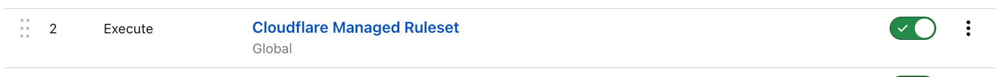

> _**Note**: that it is not recommended to have both [Account-level WAF](https://developers.cloudflare.com/waf/account/) Managed Rules, as well as Zone-level WAF Managed Rules deployed and enabled at the same time as this could lead to confusion when reviewing the [Security Events](https://developers.cloudflare.com/waf/analytics/security-events/). Preferably, standardize at account level with the Account-level WAF Managed Rules; avoid duplicating the same ruleset at the zone level unless you need zone‑specific overrides._

Reference: [Cloudflare Managed Ruleset](https://developers.cloudflare.com/waf/managed-rules/reference/cloudflare-managed-ruleset/).

#### Stricter Security Requirements with WAF Managed Ruleset

For additional and stricter security requirements, deploy some of the following rules:

- _XSS, HTML Injection_ with Rule ID _882b37d6bd5f4bf2a3cdb374d503ded0_.
- _Anomaly:URL:Path - Multiple Slashes, Relative Paths, CR, LF or NULL_ with Rule ID _6e759e70dc814d90a003f10424644cfb_.
- _Anomaly:Body - Large_ with Rule ID _7b822fd1f5814e17888ded658480ea8f_, in order to mitigate body payloads which are higher than the [processing limit](https://developers.cloudflare.com/ruleset-engine/rules-language/fields/http-request-body/).
  - It is generally recommended to add [WAF exceptions](https://developers.cloudflare.com/waf/managed-rules/waf-exceptions/) for this, especially for [upload endpoints](https://developers.cloudflare.com/cache/concepts/default-cache-behavior/#upload-limits).
- _Anomaly:Port - [Non Standard Port](https://developers.cloudflare.com/fundamentals/reference/network-ports/#how-to-block-traffic-on-additional-ports) (not 80 or 443)_ with Rule ID _8e361ee4328f4a3caf6caf3e664ed6fe_.
- _Anomaly:Method - Unusual HTTP Method_ with Rule ID _ab53f93c9b03472ab34a5405d9bdc7d5_.
- _Anomaly:Method - Unknown HTTP Method_ with Rule ID _6e2240ffcb87477bbd4881b6fd13142f_.
- Including all the _Vulnerability scanner activity_-related Rules.
- Any [other relevant Rules](https://developers.cloudflare.com/waf/change-log/) you might need.

[Log the payload of matched rules](https://developers.cloudflare.com/waf/managed-rules/payload-logging/), if required, to help diagnosing the behavior of the rules. The encrypted payloads can be found in the Metadata field in [Firewall events](https://developers.cloudflare.com/logs/reference/log-fields/zone/firewall_events/) logs.

> _**Note**: it is also generally recommended to disable (globally or selectively) [Browser Integrity Check (BIC)](https://developers.cloudflare.com/waf/tools/browser-integrity-check/), especially to prevent potential false positives with APIs / automated traffic and non-browser endpoints. Use modern detections like WAF Managed Rules and Bot Management instead._

Reference: [Security Events](https://developers.cloudflare.com/waf/analytics/security-events/) and [Changelog](https://developers.cloudflare.com/changelog/).

#### Deploy OWASP Core Ruleset

If required, review and then deploy the [OWASP Core Ruleset](https://developers.cloudflare.com/waf/managed-rules/reference/owasp-core-ruleset/).

> _**Note**: Those types of rules are prone for false positives. For customers also using [Zaraz](https://developers.cloudflare.com/zaraz/), it is recommended to configure an [exception](https://developers.cloudflare.com/ruleset-engine/managed-rulesets/create-exception/) for the configured Zaraz endpoint._

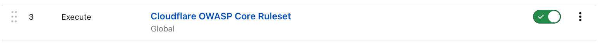

Reference: [Handle false positives / Troubleshooting](https://developers.cloudflare.com/waf/managed-rules/troubleshooting/).

---

### **WAF Custom Rules**

Custom rules give you granular control to tailor your security policy to your application's specific needs. Rules are executed in [order / phases](https://developers.cloudflare.com/waf/reference/phases/), so place your most important rules at the top.

#### Allow Verified Bots

It's ordinarily recommended to have as one of the first top Custom Rules a [SKIP Custom Rule](https://developers.cloudflare.com/waf/custom-rules/skip/), allowing Verified Bots, such as i.e. Search Engine Crawler (like _GoogleBot_). Only skip the products you actually intend to bypass (i.e. _All remaining custom rules_, _Rate limiting rules_, and _Super Bot Fight Mode_).

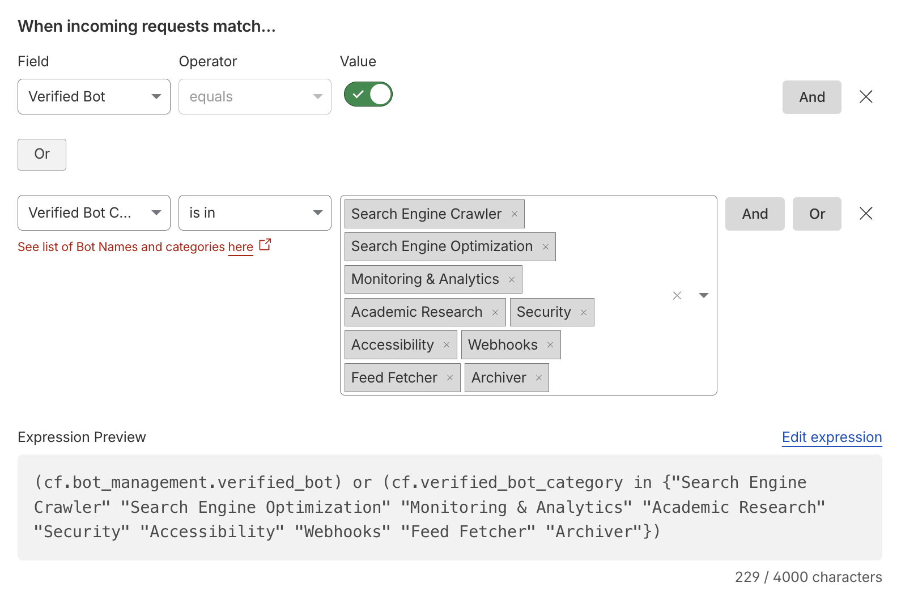

Expression Preview:

```text
(cf.verified_bot_category in {"Search Engine Crawler" "Search Engine Optimization" "Monitoring & Analytics" "Academic Research" "Security" "Accessibility" "Webhooks" "Feed Fetcher" "Archiver"})
```

> _**Note**: every request with a Verified Bot Category is by definition a Verified Bot, so `cf.bot_management.verified_bot or cf.verified_bot_category in {...}` is equivalent to `cf.bot_management.verified_bot` alone and skips **all** Verified Bots, including the `AI Crawler`, `AI Assistant`, `AI Search`, and `Aggregator` [categories](https://developers.cloudflare.com/bots/concepts/bot/verified-bots/#legacy-categories). Prefer explicitly listing the categories you want to allow. [`cf.verified_bot_category`](https://developers.cloudflare.com/ruleset-engine/rules-language/fields/reference/cf.verified_bot_category/) and [`cf.client.bot`](https://developers.cloudflare.com/ruleset-engine/rules-language/fields/reference/cf.client.bot/) are available on all plans, whereas `cf.bot_management.verified_bot` requires Bot Management._

References: [Verified Bots](https://developers.cloudflare.com/bots/concepts/bot/verified-bots/) and [Allow traffic from verified bots](https://developers.cloudflare.com/waf/custom-rules/use-cases/allow-traffic-from-verified-bots/).

#### Allow APIs

It's generally recommended to have as one of the first top Custom Rules a [SKIP Custom Rule](https://developers.cloudflare.com/waf/custom-rules/skip/), allowing your and/or partner APIs (i.e. payment callbacks, PreRender IO, etc.), being as specific and using as many [fields](https://developers.cloudflare.com/ruleset-engine/rules-language/fields/) as possible. The ultimate goal is to pursue a **positive security model** by implementing [API Shield](https://developers.cloudflare.com/api-shield/security/).

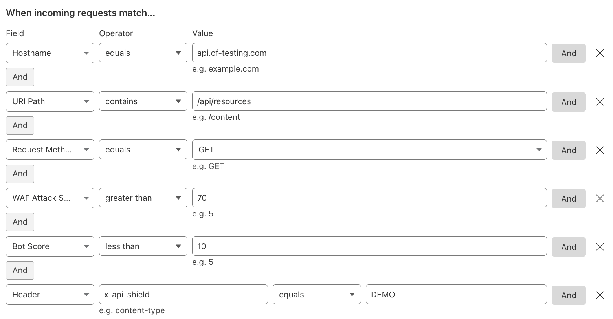

Expression Preview:

```text
(http.host eq "api.example.com" and starts_with(http.request.uri.path, "/api/resources") and http.request.method eq "GET" and cf.waf.score gt 70 and cf.bot_management.score lt 10 and any(http.request.headers["x-api-shield"][*] eq "DEMO"))
```

> _**Note**: a static header value is a shared secret that can leak. Where possible, identify partners by their source IPs in a [Custom List](https://developers.cloudflare.com/waf/tools/lists/custom-lists/) (`ip.src in $partner_ips`) or with [mTLS](#mutual-tls-authentication) (`cf.tls_client_auth.cert_verified`) instead of, or in addition to, a header. Keeping a [WAF Attack Score](https://developers.cloudflare.com/waf/detections/attack-score/) condition in a Skip rule ensures that requests which still look malicious are not exempted from the WAF Managed Rules._

Reference: [API Shield](https://developers.cloudflare.com/api-shield/).

#### Redirect to Custom HTML

Using a [Custom HTML](https://developers.cloudflare.com/waf/custom-rules/create-dashboard/#configure-a-custom-response-for-blocked-requests) response type, one can create a redirect to another site for specific requests. In this example, any non-verified bot requests coming from the US are redirected.

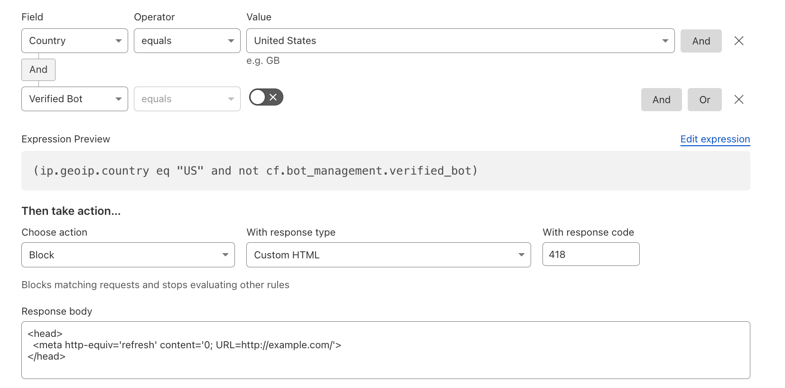

Expression Preview:

```text
(ip.src.country eq "US" and not cf.bot_management.verified_bot)
```

With the action _Block_, the response type _Custom HTML_, and a response body such as `<head><meta http-equiv='refresh' content='0; URL=https://example.com/'></head>`.

> _**Note**: the `ip.geoip.*` fields (as shown in the screenshot) are deprecated in favor of the [`ip.src.*`](https://developers.cloudflare.com/ruleset-engine/rules-language/fields/reference/ip.src.country/) fields. Existing rules keep working, but use `ip.src.country` for new rules._

#### Block Fallthrough API Requests

In order to truly enforce a Positive Security Model, for any fallthrough action of requests not matching any of the [API Shield-managed endpoints](https://developers.cloudflare.com/api-shield/management-and-monitoring/), create a WAF Custom Rule similar to the one below, preferably with more specific fields to your API.

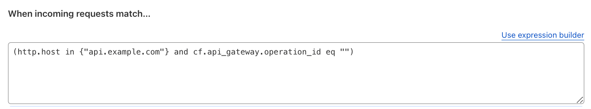

Expression Preview:

```text
(http.host eq "api.example.com" and cf.api_gateway.fallthrough_detected)
```

> _**Note**: [`cf.api_gateway.fallthrough_detected`](https://developers.cloudflare.com/ruleset-engine/rules-language/fields/reference/cf.api_gateway.fallthrough_detected/) is `true` for requests that do not match any endpoint saved in [Endpoint Management](https://developers.cloudflare.com/api-shield/management-and-monitoring/). The dashboard also offers this as the _Mitigate API requests to unidentified endpoints_ rule template. Start with the Log action, so that legitimate endpoints which are not yet saved show up in the Security Events and can be added to Endpoint Management before enforcing._

References: [Add a fallthrough rule](https://developers.cloudflare.com/api-shield/security/schema-validation/#add-a-fallthrough-rule) and [Schema Validation](https://developers.cloudflare.com/api-shield/security/schema-validation/).

#### Visibility into Non-expected Request Methods

In some cases, you want to be specific about what type of HTTP Request Methods are allowed on certain endpoints or coming from specific requests, or even just logging relevant methods for visibility.

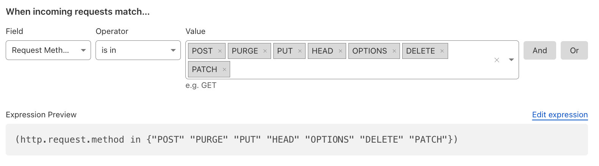

Expression Preview:

```text
(http.request.method in {"POST" "PURGE" "PUT" "HEAD" "OPTIONS" "DELETE" "PATCH"})
```

Once you know which methods your application actually needs, invert the logic into a positive security model and block everything else, adjusting the allowed set per hostname or path:

```text
(http.host eq "www.example.com" and not http.request.method in {"GET" "HEAD" "POST" "OPTIONS"})
```

Reference: [HTTP Method Field](https://developers.cloudflare.com/ruleset-engine/rules-language/fields/reference/http.request.method/).

#### Mitigate likely Malicious Payloads

Every HTTP/S request receives a WAF Attack Score (WAF ML), indicating the likelihood of containing something malicious related to SQLi, XSS, or RCE attacks. This should be used to complement existing security rules and serve as an additional signal to help mitigate potential attacks.

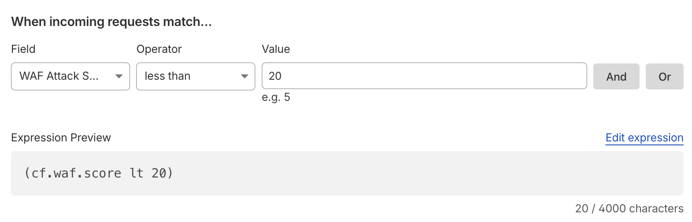

Expression Preview:

```text
(cf.waf.score lt 20)
```

Cloudflare recommends against blocking solely based on scores below `50`: block the _Attack_ range (scores `1`–`20`, as above, or a stricter threshold such as `lt 15`) and, if desired, apply a Managed Challenge to the _Likely attack_ range (`21`–`50`) only in combination with additional conditions, such as a specific URI path or the bot score.

Reference: [WAF attack score](https://developers.cloudflare.com/waf/detections/attack-score/).

#### Mitigate known Open Proxies, Anonymizers, VPNs, Malware, and Botnets

By using the Cloudflare-Managed IP Lists, including your own [Custom Lists](https://developers.cloudflare.com/waf/tools/lists/custom-lists/), you can decide what to do with those IP categories. Generally, one wants to block Botnets and Malware.

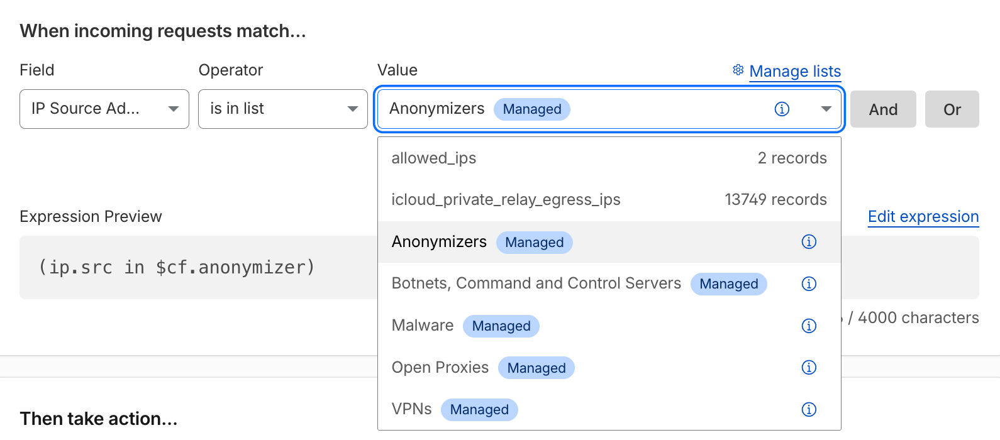

Expression Preview:

```text
(ip.src in $cf.anonymizer)
```

A practical baseline is to block the botnet and malware lists, and to log or challenge the anonymizer lists, which also contain legitimate privacy-conscious users:

```text
(ip.src in $cf.botnetcc or ip.src in $cf.malware)
```

The available [Managed IP Lists](https://developers.cloudflare.com/waf/tools/lists/managed-lists/#managed-ip-lists) are `$cf.open_proxies`, `$cf.anonymizer` (Open SOCKS proxies, VPNs, and Tor nodes), `$cf.vpn`, `$cf.malware`, and `$cf.botnetcc`.

Reference: [Managed IP Lists](https://developers.cloudflare.com/waf/tools/lists/managed-lists/#managed-ip-lists).

> _**Note**: Blocking VPNs by ASN is error-prone: VPN exit nodes mostly live in general-purpose hosting ASNs that also host legitimate services, and residential or mobile ISP ASNs should never end up on such a list. Prefer the `$cf.vpn` and `$cf.anonymizer` Managed IP Lists; if you must block by ASN, curate your own [ASN list](https://developers.cloudflare.com/waf/tools/lists/custom-lists/#lists-with-asns) and review it regularly._

#### Mitigate Tor Traffic

In case that Tor traffic – an overlay network for enabling anonymous communication – is unwanted, one can simply mitigate it. Make sure to also disable [Onion Routing](https://developers.cloudflare.com/network/onion-routing/#enable-onion-routing) in this case.

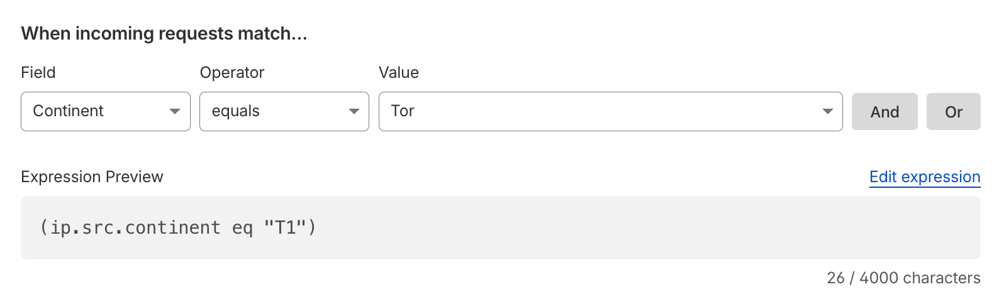

Expression Preview:

```text
(ip.src.continent eq "T1")
```

Cloudflare assigns the pseudo country and continent code `T1` to Tor exit nodes, so `ip.src.country eq "T1"` is equivalent. Tor exit nodes are also part of the `$cf.anonymizer` Managed IP List. Since Tor is also used legitimately, consider a Managed Challenge rather than a Block unless your risk profile demands it.

Reference: [Onion Routing and Tor support](https://developers.cloudflare.com/network/onion-routing/).

#### Mitigate unwanted ASNs

Any unwanted traffic coming from Cloud ASNs (such as AWS, Azure, GCP, etc.) or other ASNs from which you don't expect traffic, you might want to mitigate. Use [Lists with ASNs](https://developers.cloudflare.com/waf/tools/lists/custom-lists/#lists-with-asns) to easily manage these. One can also opt for dynamic [Managed IP Lists](https://developers.cloudflare.com/waf/tools/lists/managed-lists/#managed-ip-lists).

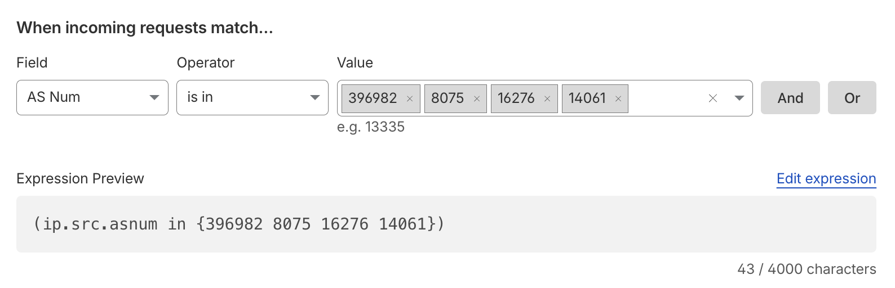

Expression Preview:

```text
(ip.src.asnum in {396982 8075 16276 14061})
```

In this example: Google Cloud (`396982`), Microsoft Azure (`8075`), OVH (`16276`), and DigitalOcean (`14061`). With a List: `(ip.src.asnum in $unwanted_asns)`.

> _**Note**: cloud ASNs also host legitimate integrations (webhooks, partner APIs, monitoring, corporate proxies). Prefer a Managed Challenge or Log action, or scope the rule to sensitive paths (login, sign-up, checkout, API) and exclude Verified Bots (`and not cf.bot_management.verified_bot`)._

Reference: [Custom Lists](https://developers.cloudflare.com/waf/tools/lists/custom-lists/).

#### Block High Risk Countries

Block high risk countries like the ones that appear in [The Office of Foreign Assets Control (OFAC) List](https://sanctionssearch.ofac.treas.gov/).

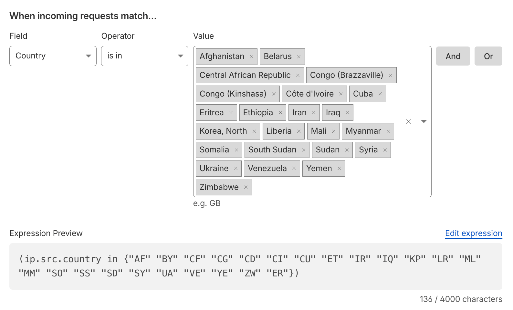

Expression Preview:

```text
(ip.src.country in {"AF" "BY" "CF" "CG" "CD" "CI" "CU" "ET" "IR" "IQ" "KP" "LR" "ML" "MM" "SO" "SS" "SD" "SY" "VE" "YE" "ZW" "ER"})
```

> _**Note**: this list is illustrative and must be aligned with your legal and compliance team. Only a few jurisdictions are under comprehensive (country-wide) sanctions; most OFAC programs target specific individuals and entities rather than entire countries, and programs change over time. If you do not intend to block all of Ukraine: the Ukraine-related sanctions are region-specific (i.e. Crimea, Donetsk, and Luhansk). Use the region-level field ([`ip.src.subdivision_1_iso_code`](https://developers.cloudflare.com/ruleset-engine/rules-language/fields/reference/ip.src.subdivision_1_iso_code/)) instead:_

```text
(ip.src.country eq "UA" and ip.src.subdivision_1_iso_code in {"UA-43" "UA-40" "UA-14" "UA-09"})
```

References: [Sanctions List Search](https://sanctionssearch.ofac.treas.gov/), [OpenSanctions](https://www.opensanctions.org/) and [Block traffic from specific countries](https://developers.cloudflare.com/waf/custom-rules/use-cases/block-traffic-from-specific-countries/).

#### Block known Bot User-Agents

Block unwanted requests of user-agents known to be used by bots, such as _cURL_, _python-requests_, _go-http-client_, or even empty user-agents.

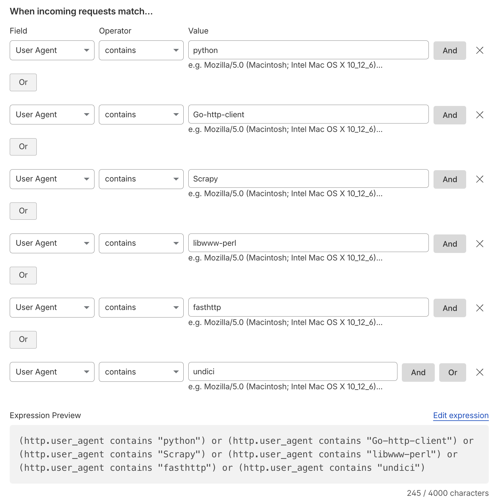

Expression Preview:

```text
(lower(http.user_agent) contains "python" or lower(http.user_agent) contains "go-http-client" or lower(http.user_agent) contains "scrapy" or lower(http.user_agent) contains "libwww-perl" or lower(http.user_agent) contains "fasthttp" or lower(http.user_agent) contains "undici" or lower(http.user_agent) contains "curl" or lower(http.user_agent) contains "wget" or http.user_agent eq "")
```

A single case-insensitive regular expression could be easier to maintain:

```text
(http.user_agent matches r"(?i)(python|go-http-client|scrapy|libwww-perl|fasthttp|undici|curl|wget)" or http.user_agent eq "")
```

> _**Note**: the `contains` operator is case-sensitive, so wrap the field in [`lower()`](https://developers.cloudflare.com/ruleset-engine/rules-language/functions/#lower) (otherwise `Python-urllib` would slip through). User-Agent strings are trivially spoofed: treat this rule as hygiene against unsophisticated tooling rather than as bot protection (see [Bot Management](#visibility-into-automated-bot-traffic)), and scope it to hostnames where no legitimate automation (your own APIs, partner integrations, monitoring) is expected._

References: [Challenge bad bots](https://developers.cloudflare.com/waf/custom-rules/use-cases/challenge-bad-bots/) and [Operators](https://developers.cloudflare.com/ruleset-engine/rules-language/operators/).

#### Restrict Access to Admin Areas and Internal Applications

Restrict access to administrative interfaces – such as the WordPress dashboard (`/wp-admin`, `/wp-login.php`) or any `/admin` path – and to internal applications like employee portals or extranets. The preferred option is a [Zero Trust approach with Cloudflare Access](https://developers.cloudflare.com/learning-paths/zero-trust-web-access/), which authenticates the user rather than the network. Where that is not possible, restrict access to specific static source IPs of employees or admins (using a [Custom List](https://developers.cloudflare.com/waf/tools/lists/custom-lists/)), to the countries in which you have employees located, or to employees with valid [mTLS](#mutual-tls-authentication) client certificates. Try to be as specific as possible, combining multiple conditions like hostname, HTTP header, ASN, and HTTP method.

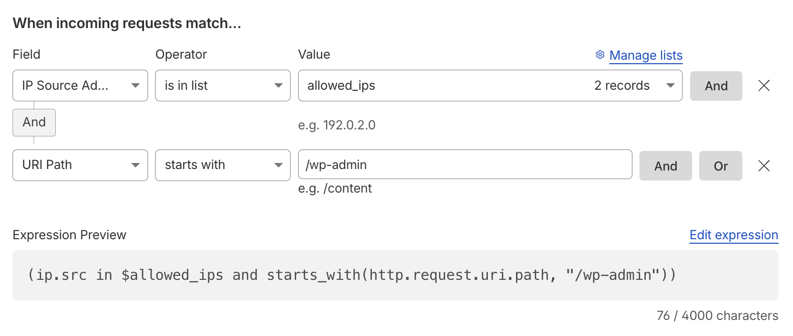

Expression Preview (block everything not coming from the allowlist):

```text
((starts_with(http.request.uri.path, "/wp-admin") or http.request.uri.path eq "/wp-login.php") and not http.request.uri.path eq "/wp-admin/admin-ajax.php" and not ip.src in $allowed_ips)
```

> _**Note**: the allowlist condition must be negated (`not ip.src in $allowed_ips`) and paired with the Block action. `ip.src in $allowed_ips and ...` combined with Block would lock out the allowlisted IPs instead. `/wp-admin/admin-ajax.php` is excluded because WordPress themes and plugins call it from the public frontend. Consider also blocking `/xmlrpc.php` unless you rely on it (i.e. Jetpack or the WordPress mobile app)._

For internal applications, restrict by country (and by any other condition that identifies your workforce, or in combination with Cloudflare Access):

```text
(http.host eq "portal.example.com" and not ip.src.country in {"DE" "ES" "US"})
```

References: [Require known IP addresses in site admin area](https://developers.cloudflare.com/waf/custom-rules/use-cases/site-admin-only-known-ips/), [Allow traffic from IP addresses in allowlist only](https://developers.cloudflare.com/waf/custom-rules/use-cases/allow-traffic-from-ips-in-allowlist/) and [Allow traffic from specific countries only](https://developers.cloudflare.com/waf/custom-rules/use-cases/allow-traffic-from-specific-countries/).

#### Block Access to Sensitive Files and Paths

Automated scanners constantly probe for configuration files, version control metadata, backups, and debugging endpoints that should never be publicly reachable. Blocking these at the edge is cheap and rarely produces false positives.

Expression Preview:

```text
((http.request.uri.path contains "/.git" or http.request.uri.path contains "/.svn" or http.request.uri.path contains "/.env" or http.request.uri.path contains "/.htaccess" or http.request.uri.path contains "/.htpasswd" or http.request.uri.path contains "/.DS_Store" or ends_with(http.request.uri.path, ".sql") or ends_with(http.request.uri.path, ".bak") or ends_with(http.request.uri.path, ".old") or http.request.uri.path in {"/wp-config.php" "/phpinfo.php"}) and not starts_with(http.request.uri.path, "/.well-known/"))
```

> _**Note**: keep `/.well-known/` reachable, as it is used by ACME (HTTP DCV) certificate validation, `security.txt`, and similar standards. Adjust the list to your stack, and remember that the real fix is to not have these files on the origin server at all._

Reference: [Common use cases for custom rules](https://developers.cloudflare.com/waf/custom-rules/use-cases/) and [Functions](https://developers.cloudflare.com/ruleset-engine/rules-language/functions/).

#### Mutual TLS Authentication

Block all requests that do not have a valid client certificate for Mutual TLS (mTLS) authentication on a specific hostname. In this scenario, mTLS refers to the connection between the client and Cloudflare.

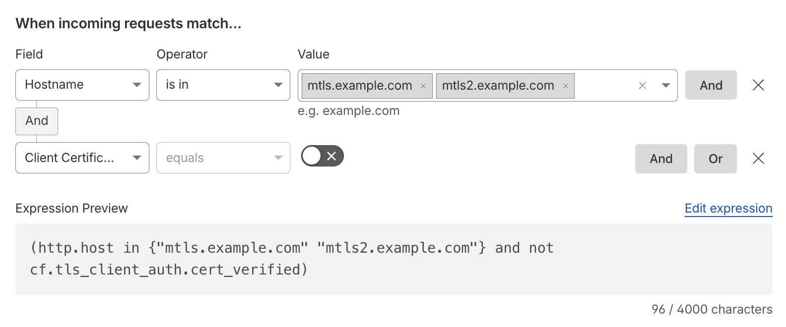

Expression Preview:

```text
(http.host in {"mtls.example.com" "mtls2.example.com"} and not cf.tls_client_auth.cert_verified)
```

Additionally, another consideration is to also check if the Client Certificates, generated with the default Cloudflare Managed CA, have been [revoked](https://developers.cloudflare.com/api-shield/security/mtls/configure/#check-for-revoked-certificates) and block those. A revoked certificate still counts as verified (`cf.tls_client_auth.cert_verified` remains `true`), which is why the revocation check is required.

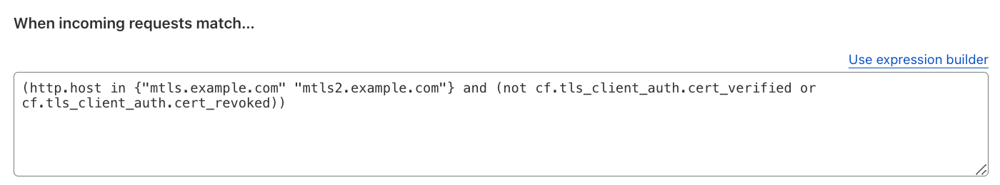

Expression Preview:

```text
(http.host in {"mtls.example.com" "mtls2.example.com"} and (not cf.tls_client_auth.cert_verified or cf.tls_client_auth.cert_revoked))
```

References: [Cloudflare Public Key Infrastructure (PKI)](https://developers.cloudflare.com/ssl/client-certificates/), [CFSSL](https://cfssl.org/), [API Shield mTLS](https://developers.cloudflare.com/api-shield/security/mtls/) and [Workers mTLS](https://developers.cloudflare.com/workers/runtime-apis/bindings/mtls/). Check out this Learning Path on [mTLS at Cloudflare](https://developers.cloudflare.com/learning-paths/mtls/).

Another interesting use case is to associate specific mTLS hostnames with Client Certificate Serial Numbers ([`cf.tls_client_auth.cert_serial`](https://developers.cloudflare.com/ruleset-engine/rules-language/fields/dynamic-fields/#cftls_client_authcert_serial)). This allows for more granular control.

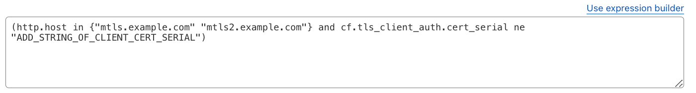

Expression Preview:

```text
(http.host in {"mtls.example.com" "mtls2.example.com"} and cf.tls_client_auth.cert_serial ne "<CLIENT_CERT_SERIAL>")
```

#### User-Specific JWT Claim Mitigation

To enhance the security of your API endpoints that rely on JSON Web Tokens (JWT), you can create rules targeting specific JWT claims, such as the user claim.

In this example, requests from `admin` users based on the `user` claim are subjected to additional scrutiny by challenging requests flagged as potentially malicious based on their [WAF Attack Score](https://developers.cloudflare.com/waf/detections/attack-score/).

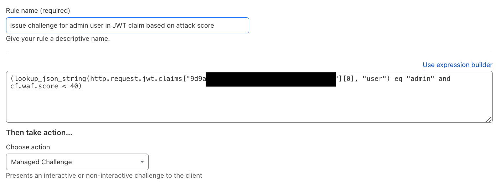

Expression Preview:

```text
(lookup_json_string(http.request.jwt.claims["<TOKEN_CONFIGURATION_ID>"][0], "user") eq "admin" and cf.waf.score lt 40)
```

> _**Note**: `<TOKEN_CONFIGURATION_ID>` is the ID of the [JWT Validation](https://developers.cloudflare.com/api-shield/security/jwt-validation/) token configuration in API Shield, which must exist before the claims can be referenced in rules._

Reference: [Issue challenge for admin user in JWT claim based on attack score](https://developers.cloudflare.com/waf/custom-rules/use-cases/check-jwt-claim-to-protect-admin-user/) and [API Shield](https://developers.cloudflare.com/api-shield/).

#### Visibility into Automated Bot Traffic

In general, one wants to have visibility into automated traffic. This can be commonly achieved with a [LOG](https://developers.cloudflare.com/ruleset-engine/rules-language/actions/) action, logging anything with a [Bot Score](https://developers.cloudflare.com/bots/concepts/bot-score/) "likely automated" based on available [detection engines](https://developers.cloudflare.com/bots/concepts/bot-detection-engines/).

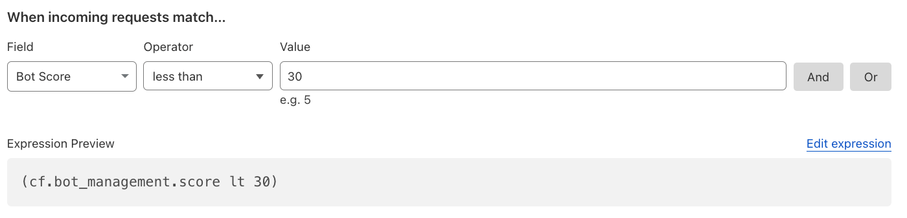

Expression Preview:

```text
(cf.bot_management.score lt 30 and not cf.bot_management.verified_bot and not cf.bot_management.static_resource)
```

Once the traffic is understood, a common baseline is to _Block_ definitely automated traffic (`cf.bot_management.score eq 1`) and to _Managed Challenge_ likely automated traffic (scores `2`–`29`), always excluding Verified Bots and explicitly exempting your own API and mobile app traffic (i.e. `and not starts_with(http.request.uri.path, "/api/")`), which cannot solve [Challenges](https://developers.cloudflare.com/cloudflare-challenges/challenge-types/challenge-pages/#compatibility-limitations). Customers without Enterprise Bot Management should use [Super Bot Fight Mode](https://developers.cloudflare.com/bots/get-started/super-bot-fight-mode/) instead.

References: [Bot Management variables](https://developers.cloudflare.com/bots/reference/bot-management-variables/) and [Challenge bad bots](https://developers.cloudflare.com/waf/custom-rules/use-cases/challenge-bad-bots/).

#### Mitigating Pretend-Browsers with JavaScript Detections

In scenarios where the [BotScore](https://developers.cloudflare.com/bots/concepts/bot-score/) alone may not reliably differentiate between likely human and bots, you can enhance detection by optionally enabling [JavaScript Detections (JSD)](https://developers.cloudflare.com/bots/reference/javascript-detections/).

> _**Note**: JSD can only be applied to HTML responses (`Content-Type: text/html`) and it cannot be at the root/first HTML request as the JavaScript needs to be injected first._

When enforced via [`cf.bot_management.js_detection.passed`](https://developers.cloudflare.com/ruleset-engine/rules-language/fields/dynamic-fields/#cfbot_managementjs_detectionpassed) rules and a [Managed Challenge](https://developers.cloudflare.com/cloudflare-challenges/challenge-types/challenge-pages/#managed-challenge-recommended), JSD ensures active verification checks.

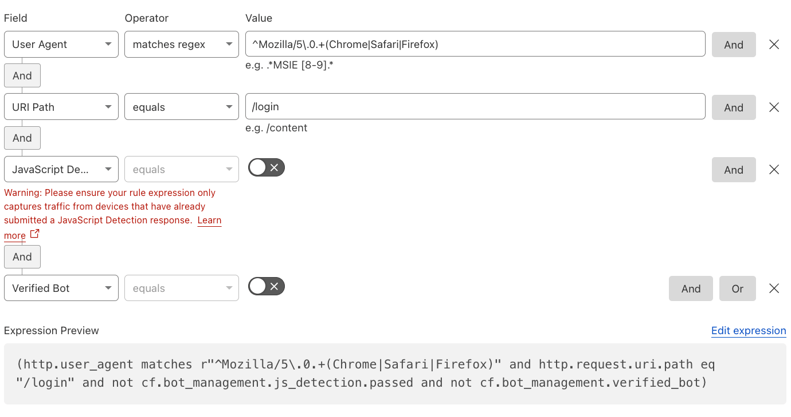

Expression Preview:

```text
(http.user_agent matches r"^Mozilla/5\.0.+(Chrome|Safari|Firefox)" and http.request.uri.path eq "/login" and http.request.method eq "POST" and not cf.bot_management.js_detection.passed and not cf.bot_management.verified_bot)
```

Restricting the rule to `POST` requests ensures it never matches the first HTML request (the login page itself), which is where the JavaScript gets injected. Always use the Managed Challenge action, since legitimate users may not have passed JSD for benign reasons (ad blockers, disabled JavaScript, network issues).

> _**Note**: Test with a logging action before enforcing rules to avoid impacting legitimate traffic. Additionally, the Rule should only apply on critical paths and not on initial landing pages, where JS might have not been injected yet. Never apply it to native mobile app or WebSocket endpoints._

Reference: [Enforcing execution of JavaScript detections](https://developers.cloudflare.com/bots/reference/javascript-detections/#enforcing-execution-of-javascript-detections).

#### Visibility into IPv6 IPs

Most web applications want to be available via IPv6 IP addresses. However, in case that IPv6 is undesired, customers can mitigate IPv6 IPs through the WAF and also disable [IPv6 compatibility](https://developers.cloudflare.com/network/ipv6-compatibility/#disable-ipv6-compatibility), if needed.

> _**Note**: that this will also block [Cloudflare Workers](https://developers.cloudflare.com/fundamentals/reference/http-headers/#cf-worker) scripts. In order to allow Workers, review the [Mitigate Unauthorized Cloudflare Workers](#mitigate-unauthorized-cloudflare-workers) section._

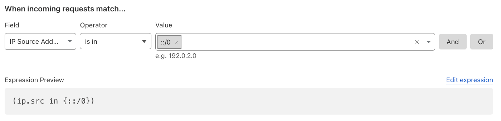

Expression Preview:

```text
(ip.src in {::/0})
```

Reference: [IPv6 compatibility](https://developers.cloudflare.com/network/ipv6-compatibility/).

#### Account Takeover (ATO) Detections

To detect and mitigate predictable bot behavior, such as _login failures_, one can use [Detection IDs](https://developers.cloudflare.com/bots/concepts/detection-ids/). This is also available for Rate Limiting Rules.

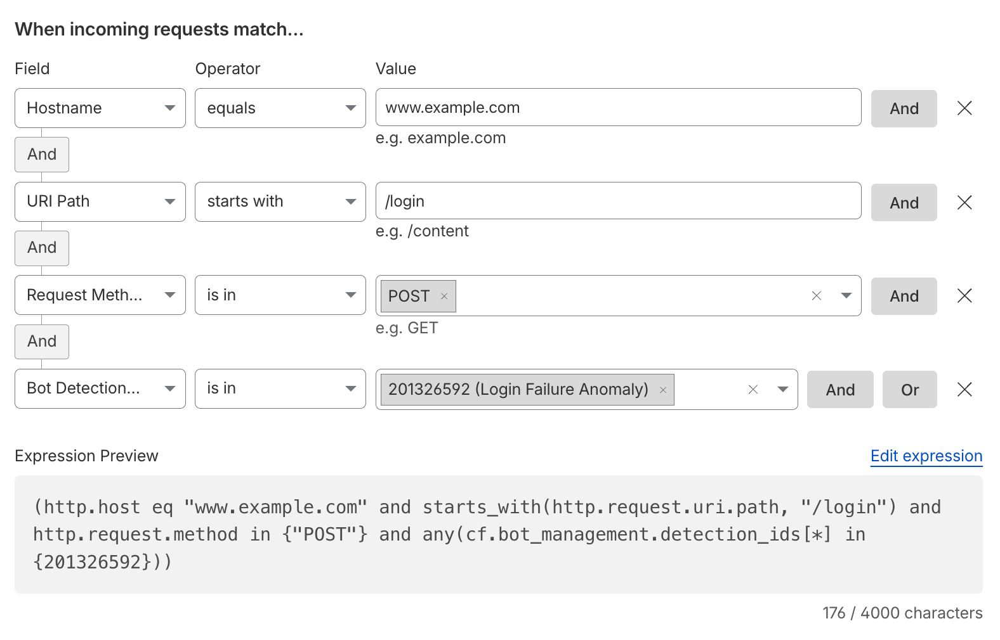

Expression Preview:

```text
(http.host eq "www.example.com" and starts_with(http.request.uri.path, "/login") and http.request.method in {"POST"} and any(cf.bot_management.detection_ids[*] in {201326592}))
```

> _**Note**: Detection ID `201326592` flags clients making a suspicious amount of login failures, `201326593` a suspicious amount of login attempts. Cloudflare detects common login endpoints automatically; label non-traditional ones with `cf-log-in` using [Endpoint Labels](https://developers.cloudflare.com/api-shield/management-and-monitoring/endpoint-labels/) so the detections apply to them._

Reference: [Account takeover detections](https://developers.cloudflare.com/bots/additional-configurations/detection-ids/account-takeover-detections/) and [Turnstile](https://developers.cloudflare.com/turnstile/).

#### Mitigate Disposable Emails on SignUps

To prevent users from signing up with known disposable emails, Cloudflare's Disposable Email Check can easily check this behavior and the customer can decide what to do with this: block, challenge, log, rate limit, or even [add a request header](https://developers.cloudflare.com/rules/transform/request-header-modification/) for the origin server.

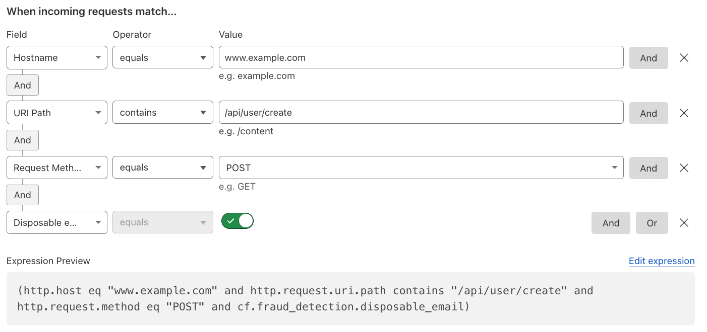

Expression Preview:

```text
(http.host eq "www.example.com" and http.request.uri.path contains "/api/user/create" and http.request.method eq "POST" and cf.fraud_detection.disposable_email)
```

> _**Note**: label your sign-up endpoint with `cf-sign-up` using [Endpoint Labels](https://developers.cloudflare.com/api-shield/management-and-monitoring/endpoint-labels/) if it is not detected automatically._

References: [Account Abuse Protection](https://developers.cloudflare.com/bots/account-abuse-protection/) and [Cloudflare Fraud Detection](https://blog.cloudflare.com/cloudflare-fraud-detection).

#### Mitigate Authentication Requests

Prevent or trigger a different behavior when a user tries to log in (authentication event) with leaked credentials, as per [Have I been Pwned (HIBP)](https://haveibeenpwned.com/). Or use different related [fields](https://developers.cloudflare.com/ruleset-engine/rules-language/fields/dynamic-fields/#cfwafcredential_checkpassword_leaked).

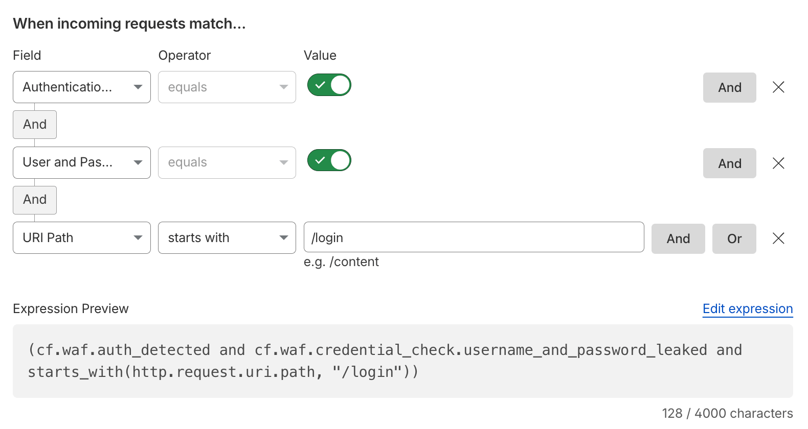

Expression Preview:

```text
(cf.waf.auth_detected and cf.waf.credential_check.username_and_password_leaked and starts_with(http.request.uri.path, "/login"))
```

> _**Note**: [`cf.waf.auth_detected`](https://developers.cloudflare.com/ruleset-engine/rules-language/fields/dynamic-fields/#cfwafauth_detected) is `true` whenever Cloudflare detected authentication credentials in the request. A simpler variant that works in several cases is `(starts_with(http.request.uri.path, "/login") and http.request.method eq "POST" and cf.waf.credential_check.password_leaked)`. Cloudflare's own example uses a Managed Challenge for leaked username-password pairs. Alternatively, forward the [`Exposed-Credential-Check`](https://developers.cloudflare.com/rules/transform/managed-transforms/reference/#add-leaked-credentials-checks-header) header to the origin via the Managed Transform and prompt the user to reset their password._

Reference: [Leaked credentials detection](https://developers.cloudflare.com/waf/detections/leaked-credentials/).

#### Time-based Rules

Time-based rules can leverage the [http.request.timestamp.sec](https://developers.cloudflare.com/ruleset-engine/rules-language/fields/reference/http.request.timestamp.sec/) field to apply logic based on specific time periods (useful for maintenance windows or scheduled security posture changes).

For example, you could block all POST or PUT requests to a particular endpoint during a defined time frame.

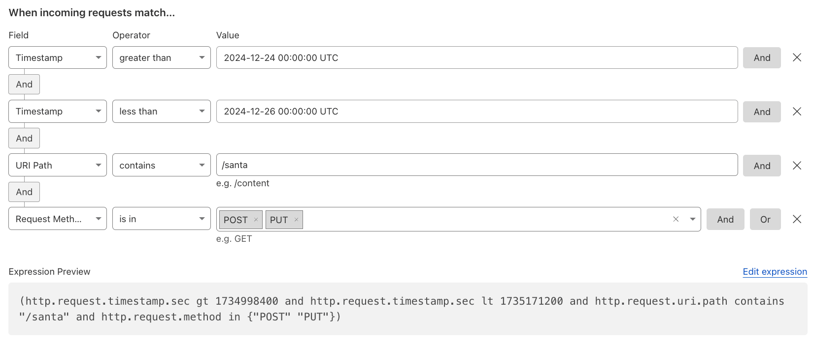

Expression Preview:

```text
(http.request.timestamp.sec gt 1734998400 and http.request.timestamp.sec lt 1735171200 and http.request.uri.path contains "/santa" and http.request.method in {"POST" "PUT"})
```

Or simply Log or Skip (allow) specific requests for a specific time.

> _**Note**: The timestamp is represented in UNIX time (epoch time) and consists of a 10-digit value. The dashboard converts the human-readable UTC date into the epoch value for you._

Reference: [Configure a rule with the Skip action](https://developers.cloudflare.com/waf/custom-rules/skip/).

#### Mitigate Unauthorized Cloudflare Workers

The [`CF-Worker`](https://developers.cloudflare.com/fundamentals/reference/http-headers/#cf-worker) request header identifies the originating host of a subrequest made by a [Cloudflare Workers Subrequest](https://developers.cloudflare.com/workers/platform/limits/#subrequests), such as when using the [Fetch API](https://developers.cloudflare.com/workers/runtime-apis/fetch/).

Do not use `CF-Worker` in WAF Custom Rules, as it is added after rule evaluation. Instead, use [`cf.worker.upstream_zone`](https://developers.cloudflare.com/ruleset-engine/rules-language/fields/reference/cf.worker.upstream_zone/), which holds the same value.

**Block a specific Worker:**

```text
cf.worker.upstream_zone eq "example.com"
```

**Block all Worker subrequests except from your own Worker:**

```text
not (cf.worker.upstream_zone in {"" "your-zone.com"})
```

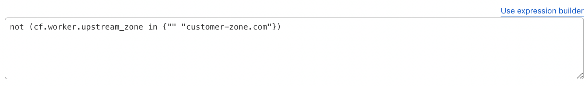

Reference: [CF-Connecting-IP in Worker subrequests](https://developers.cloudflare.com/fundamentals/reference/http-headers/#cf-connecting-ip-in-worker-subrequests).

#### More Common Use Cases for Custom Rules

Review the [get started guide](https://developers.cloudflare.com/waf/get-started/) and the [common use cases for custom rules](https://developers.cloudflare.com/waf/custom-rules/use-cases/) for more examples. Additionally, for some use cases or if you are managing many Zones, the [Account-level WAF](https://developers.cloudflare.com/waf/managed-rules/deploy-account-dashboard/) can be a good feature to have.

Moreover, monitor and [replace insecure JS libraries](https://developers.cloudflare.com/waf/tools/replace-insecure-js-libraries/) used in your applications.

Review all the [fields reference](https://developers.cloudflare.com/ruleset-engine/rules-language/fields/).

---

### **Rate Limiting Rules**

Rate limiting is essential for protecting your application from brute-force attacks, denial-of-service, and other forms of abuse.

#### IP-based Rate Limiting for Logins

To protect login endpoints from multiple login attempts from the same IP address, rate limit based on the required [characteristics](https://developers.cloudflare.com/waf/rate-limiting-rules/parameters/#with-the-same-characteristics).

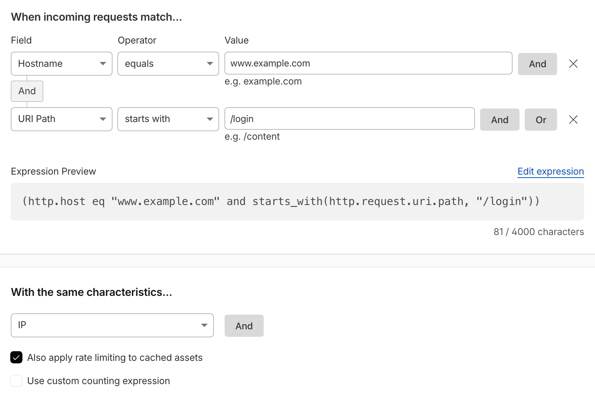

Expression Preview:

```text
(http.host eq "www.example.com" and starts_with(http.request.uri.path, "/login") and http.request.method eq "POST")
```

With the same characteristics: _IP_

Limiting the expression to `POST` requests counts actual login attempts rather than page loads. For audiences behind CGNAT or corporate proxies, where many users share one IP, use _IP with NAT support_ combined with another characteristic such as _Path_ or _Header value of_, and prefer a Managed Challenge over a Block for the first tier (i.e. more than 5 attempts per minute).

Reference: [Rate limiting parameters](https://developers.cloudflare.com/waf/rate-limiting-rules/parameters/) and [IP with NAT support](https://developers.cloudflare.com/waf/rate-limiting-rules/parameters/#use-cases-of-ip-with-nat-support).

#### Rate Limiting Uploads

To prevent too many uploads / HTTP requests using POST / PUT / PATCH methods.

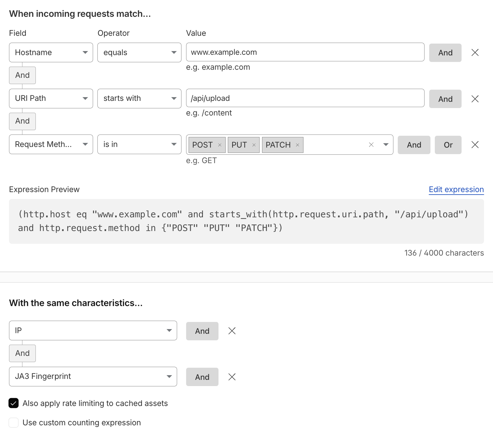

Expression Preview:

```text
(http.host eq "www.example.com" and starts_with(http.request.uri.path, "/api/upload") and http.request.method in {"POST" "PUT" "PATCH"})
```

With the same characteristics: _IP_ and _JA3 Fingerprint_ (the [JA3/JA4](https://developers.cloudflare.com/bots/additional-configurations/ja3-ja4-fingerprint/) characteristics require Enterprise Bot Management; otherwise use _IP_ or _IP with NAT support_ alone)

Reference: [Standard fields](https://developers.cloudflare.com/ruleset-engine/rules-language/fields/#standard-fields).

#### Rate Limit Credential Stuffing

To protect against credential stuffing attacks, it's generally recommended using a layered-security approach. This rate limiting rule is but one example of several approaches.

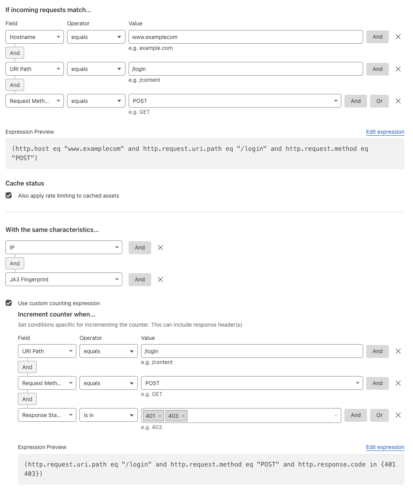

Expression Preview:

```text
(http.host eq "www.example.com" and starts_with(http.request.uri.path, "/login") and http.request.method eq "POST")
```

With the same characteristics: _IP_ and _JA3 Fingerprint_

Custom Counting Expression:

```text
(starts_with(http.request.uri.path, "/login") and http.request.method eq "POST" and http.response.code in {401 403})
```

Counting only failed logins (`401`/`403` responses from the origin) means legitimate users who log in successfully are not rate limited by this rule. Cloudflare's reference implementation uses three tiers with increasing penalties: i.e. 4 failures per minute → Managed Challenge, 10 per 10 minutes → Managed Challenge, 20 per hour → Block for a day.

> _**Note**: a [custom counting expression](https://developers.cloudflare.com/waf/rate-limiting-rules/parameters/#increment-counter-when) does **not** automatically extend the rule expression, which is why the path and method are repeated in it. Without them, any `401`/`403` response on any URL would increment the counter._

Reference: [Protecting against credential stuffing](https://developers.cloudflare.com/waf/rate-limiting-rules/best-practices/#protecting-against-credential-stuffing) and [Find an appropriate rate limit](https://developers.cloudflare.com/waf/rate-limiting-rules/find-rate-limit/).

#### Rate Limit Suspicious Logins

Implement rate limiting for suspicious login attempts (authentication events) using leaked credentials, specifically leaked passwords, as per [Have I been Pwned (HIBP)](https://haveibeenpwned.com/).

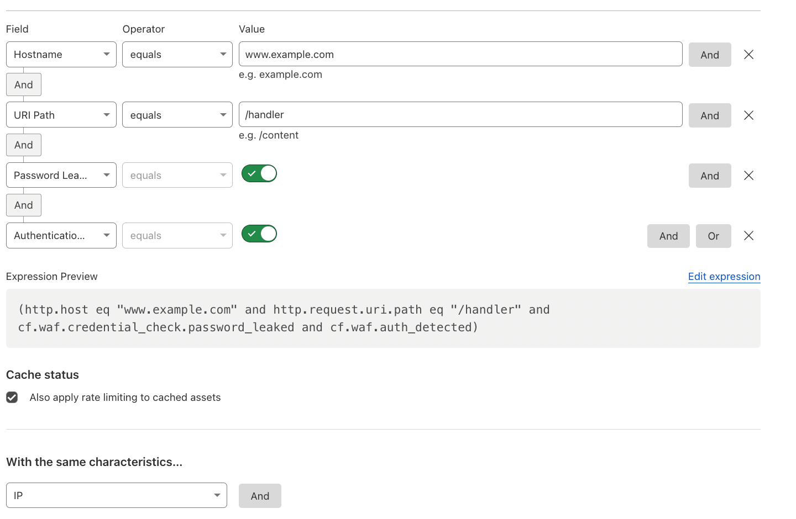

Expression Preview:

```text
(http.host eq "www.example.com" and starts_with(http.request.uri.path, "/login") and http.request.method eq "POST" and cf.waf.credential_check.password_leaked)
```

With the same characteristics: _IP_

Cloudflare's own example combines the leaked credentials fields with the [ATO detection IDs](#account-takeover-ato-detections): `(any(cf.bot_management.detection_ids[*] eq 201326593) and cf.waf.credential_check.username_and_password_leaked)`.

Reference: [Leaked credentials detection](https://developers.cloudflare.com/waf/detections/leaked-credentials/) and [Rate limit suspicious logins with leaked credentials](https://developers.cloudflare.com/waf/detections/leaked-credentials/examples/).

#### Rate Limit OTP, Verification and Password Reset Endpoints

One-time password (OTP), e-mail/SMS verification, and password reset endpoints are brute-forced just like logins, but are frequently forgotten. Count only failed attempts so that users submitting a valid code are never affected.

Expression Preview:

```text
(http.host eq "www.example.com" and http.request.uri.path in {"/api/otp/validate" "/account/verify" "/password-reset"} and http.request.method eq "POST")
```

With the same characteristics: _IP_

Custom Counting Expression:

```text
(http.request.uri.path in {"/api/otp/validate" "/account/verify" "/password-reset"} and http.request.method eq "POST" and http.response.code in {401 403})
```

Use a low threshold, for example 5 requests per minute, with the action Block for 10 minutes. If your endpoint returns `200` for both valid and invalid codes (with the result in the response body), drop the response code condition and use request-based counting with a lower threshold instead.

Reference: [Protect OTP and verification endpoints](https://developers.cloudflare.com/waf/rate-limiting-rules/best-practices/#protect-otp-and-verification-endpoints).

#### Geography-based Rate Limiting

If there are markets from which one does not expect a lot of traffic coming from in general, one could rate limit requests coming from those countries based on IPs or other [characteristics](https://developers.cloudflare.com/waf/rate-limiting-rules/parameters/#with-the-same-characteristics).

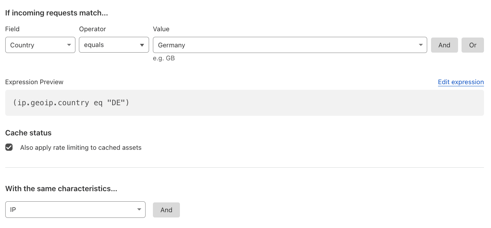

Expression Preview:

```text
(ip.src.country in {"DE"})
```

With the same characteristics: _IP_

> _**Note**: the `ip.geoip.country` field shown in the screenshot is deprecated in favor of `ip.src.country`._

Reference: [Enforcing granular access control](https://developers.cloudflare.com/waf/rate-limiting-rules/best-practices/#enforcing-granular-access-control).

#### IPv6-based Rate Limiting

To protect against entire [IPv6 Prefixes](https://en.wikipedia.org/wiki/IPv6_address), rate limit with the [custom characteristics](https://developers.cloudflare.com/waf/rate-limiting-rules/parameters/#with-the-same-characteristics) using the [cidr6 function](https://developers.cloudflare.com/ruleset-engine/rules-language/functions/#cidr6) and specifying the prefix length.

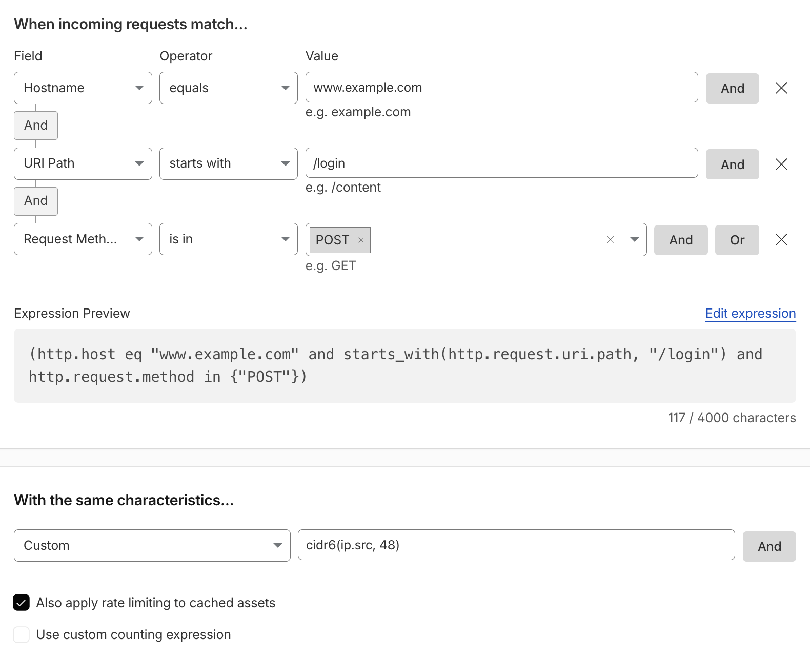

Expression Preview:

```text
(http.host eq "www.example.com" and starts_with(http.request.uri.path, "/login") and http.request.method in {"POST"})
```

With the same characteristics: _Custom_: `cidr6(ip.src, 48)`

ISPs typically hand out a `/64`, `/56`, or `/48` per subscriber, so `cidr6(ip.src, 64)` is the most granular per-subscriber bucket, while `/48` aggregates larger allocations (and therefore more clients, increasing the false-positive risk). IPv4 addresses are passed through unchanged, so the same rule keeps working for IPv4 clients, or use the [cidr function](https://developers.cloudflare.com/ruleset-engine/rules-language/functions/#cidr).

Reference: [Rules language](https://developers.cloudflare.com/ruleset-engine/rules-language/).

#### Client Certificate-based Rate Limiting

Rate limit based on the same Client Certificate being used multiple times over a specific period of time, in order to prevent abuse of potentially compromised certificates or devices. This is part of mTLS protection.

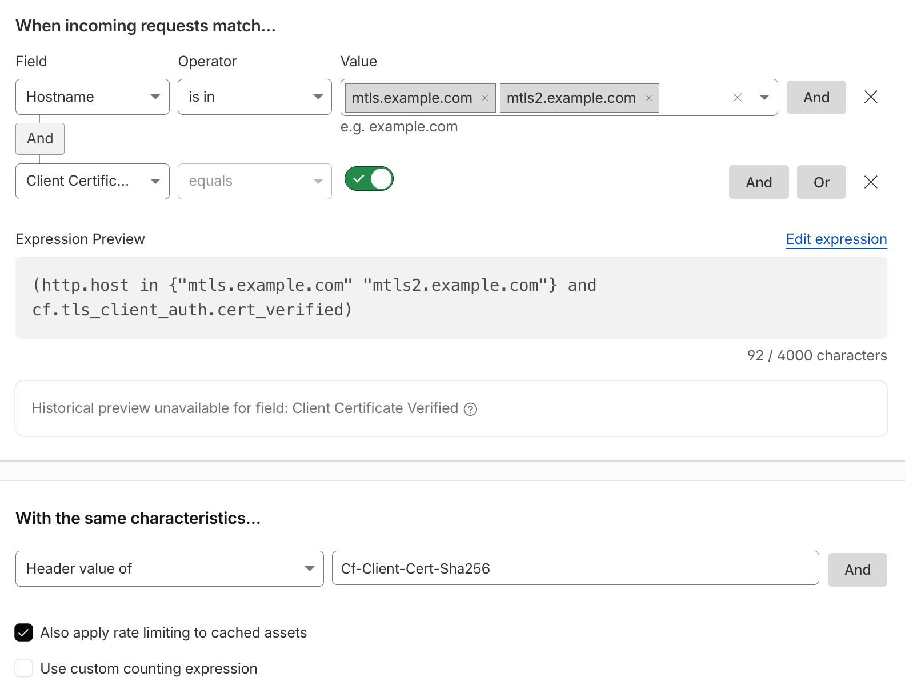

Expression Preview:

```text
(http.host in {"mtls.example.com" "mtls2.example.com"} and cf.tls_client_auth.cert_verified)
```

With the same characteristics: _Header value of_: [`Cf-Client-Cert-Sha256`](https://developers.cloudflare.com/learning-paths/mtls/mtls-app-security/related-features/#rate-limiting-by-client-certificates)

> _**Note**: the `Cf-Client-Cert-Sha256` header is only present once [client certificate forwarding](https://developers.cloudflare.com/ssl/client-certificates/forward-a-client-certificate/) has been enabled for the hostname via the API. Alternatively, use the _Custom_ characteristic with the [`cf.tls_client_auth.cert_fingerprint_sha256`](https://developers.cloudflare.com/ruleset-engine/rules-language/fields/dynamic-fields/#cftls_client_authcert_fingerprint_sha256) field directly._

Reference: [SHA-256 fingerprint of the certificate](https://developers.cloudflare.com/ruleset-engine/rules-language/fields/dynamic-fields/#cftls_client_authcert_fingerprint_sha256).

#### JavaScript Detection-based Rate Limiting

Use [JavaScript Detections (JSD)](https://developers.cloudflare.com/bots/reference/javascript-detections/) to identify human-like clients by solving a challenge in subsequent HTML requests, flagged as [`cf.bot_management.js_detection.passed`](https://developers.cloudflare.com/ruleset-engine/rules-language/fields/dynamic-fields/#cfbot_managementjs_detectionpassed). Since JSD cannot run on the first HTML request, track failed JSD attempts on subsequent HTML responses (`Content-Type: text/html`) and block or challenge clients i.e. after 5 consecutive failures within a 10-minute window.

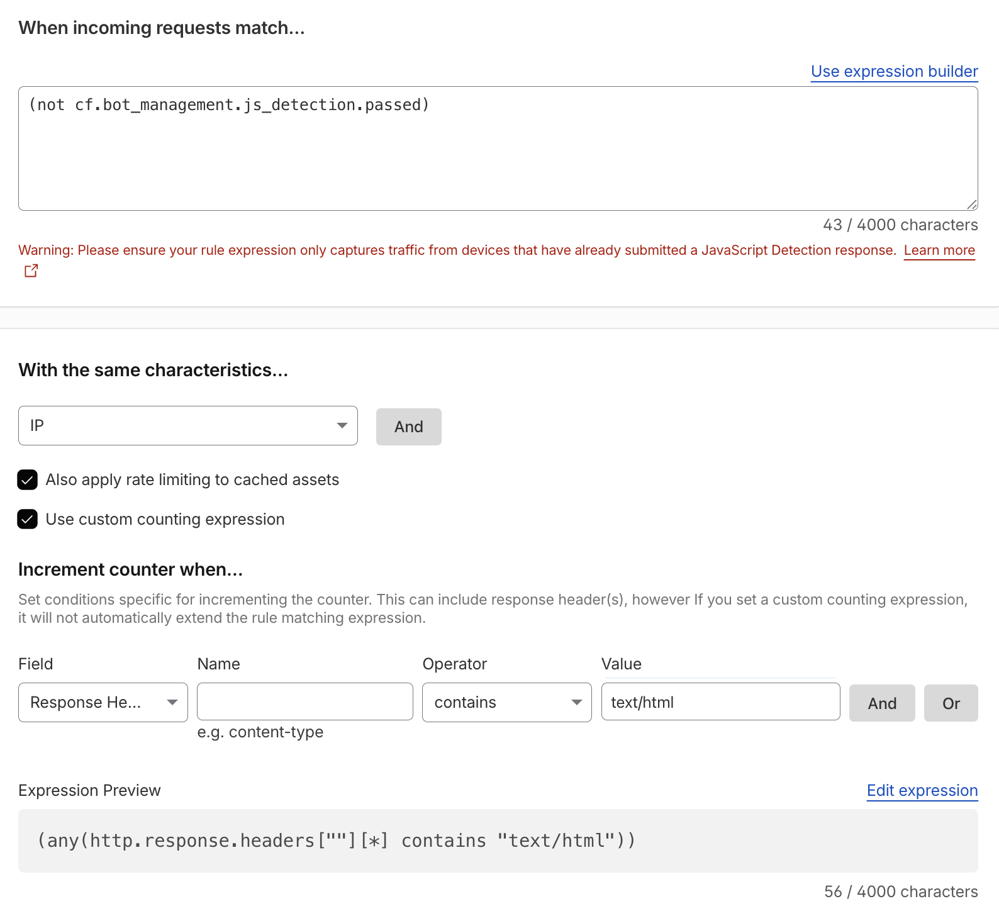

Expression Preview:

```text
(not cf.bot_management.js_detection.passed and not cf.bot_management.verified_bot)
```

With the same characteristics: _IP_

Custom Counting Expression:

```text
(not cf.bot_management.js_detection.passed and not cf.bot_management.verified_bot and any(http.response.headers["content-type"][*] contains "text/html"))
```

> _**Note**: the counting expression must repeat the JSD condition, otherwise every HTML response from that IP – including those of clients that did pass JSD – would increment the counter. Verified Bots do not execute JavaScript and are excluded in this case. Use the Managed Challenge action for the same reasons as in [Mitigating Pretend-Browsers with JavaScript Detections](#mitigating-pretend-browsers-with-javascript-detections)._

Reference: [Do the Challenge actions support content types other than HTML (for example, AJAX or XHR requests)?](https://developers.cloudflare.com/cloudflare-challenges/frequently-asked-questions/#do-the-challenge-actions-support-content-types-other-than-html-for-example-ajax-or-xhr-requests).

#### Cookie-based Rate Limiting

In order to limit the amount of times a cookie can be used, one can rate limit by its [characteristics](https://developers.cloudflare.com/waf/rate-limiting-rules/parameters/#with-the-same-characteristics). For example, rate limit session cookies or limit the amount of times a single [`cf_clearance` cookie](https://developers.cloudflare.com/cloudflare-challenges/challenge-types/challenge-pages/challenge-passage/) can be used.

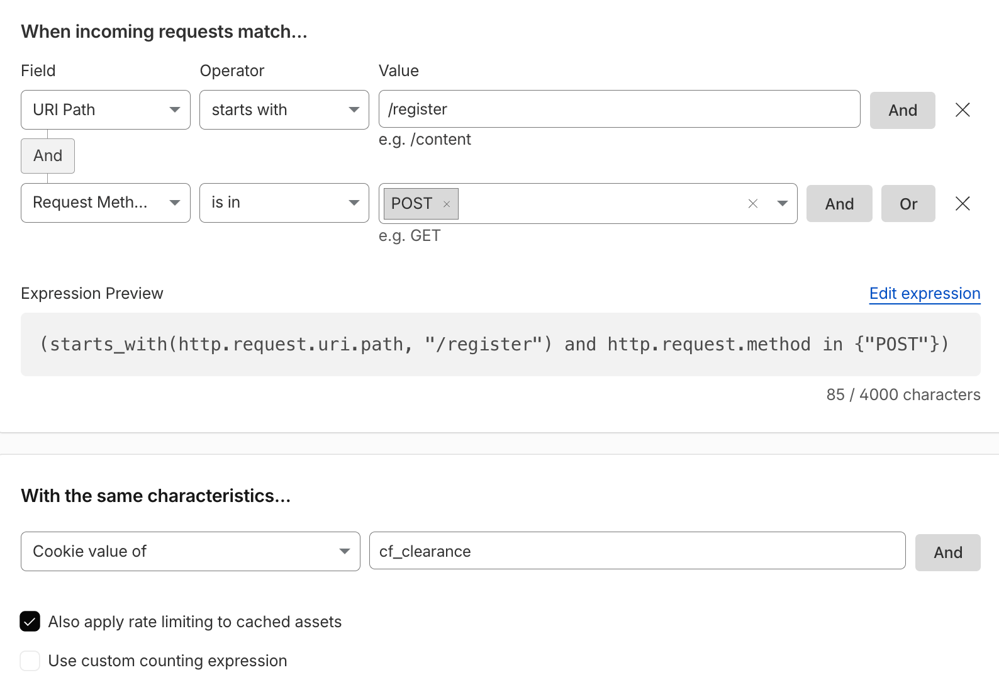

Expression Preview:

```text
(starts_with(http.request.uri.path, "/register") and http.request.method in {"POST"})
```

With the same characteristics: _Cookie value of_: [`cf_clearance`](https://developers.cloudflare.com/cloudflare-challenges/concepts/clearance/#cf_clearance-cookies)

> _**Note**: the `cf_clearance` cookie lifetime is defined by the [Challenge Passage](https://developers.cloudflare.com/cloudflare-challenges/challenge-types/challenge-pages/challenge-passage/) (30 minutes by default; Cloudflare recommends between 15 and 45 minutes). A longer passage means fewer repeated challenges for real users, but also a longer window in which a single solved clearance can be replayed by bots, which this rule mitigates. The Challenge Passage does not apply to rate limiting rules. When rate limiting by cookie, also add a custom rule blocking requests that carry more than one value for that cookie, and validate the cookie at the origin._

Reference: [Cloudflare Cookies](https://developers.cloudflare.com/fundamentals/reference/policies-compliances/cloudflare-cookies/) and [Limit reuse of a single cf_clearance cookie](https://developers.cloudflare.com/waf/rate-limiting-rules/best-practices/#limit-reuse-of-a-single-cf_clearance-cookie).

#### Rate Limit API Clients by Key or Token

For authenticated APIs, rate limit per API key, bearer token, or session rather than per IP, since one key may be used from many IPs (and many keys from one IP). Use [API Discovery](https://developers.cloudflare.com/api-shield/security/api-discovery/) or the [request rate analysis](https://developers.cloudflare.com/waf/rate-limiting-rules/find-rate-limit/) to find a suitable threshold per endpoint.

Expression Preview:

```text
(http.host eq "api.example.com" and starts_with(http.request.uri.path, "/v1/") and len(http.request.headers["x-api-key"]) gt 0)
```

With the same characteristics: _Header value of_: `x-api-key` (or `authorization`)

> _**Note**: header names must be lowercase when used via the API. Requests without the header fall into their own counter, which is why the expression checks for its presence; unauthenticated requests are better handled by a separate rule keyed on IP. The identifier can also be a cookie, a query parameter, a JSON body field, or a [JWT claim](https://developers.cloudflare.com/waf/rate-limiting-rules/parameters/#requirements-for-using-claims-inside-a-json-web-token-jwt)._

Reference: [Protecting REST APIs](https://developers.cloudflare.com/waf/rate-limiting-rules/best-practices/#protecting-rest-apis).

#### Rate Limit Clients Generating Errors

Clients producing a high volume of `403` or `404` responses are usually scanners, scrapers, or fuzzers enumerating paths. A rule that counts error responses per client catches this behavior regardless of the tool being used.

Expression Preview:

```text
(http.host eq "www.example.com")
```

With the same characteristics: _IP_

Custom Counting Expression:

```text
(http.host eq "www.example.com" and http.response.code in {403 404})
```

Apply a Managed Challenge once, for example, more than 20 errors are counted within 1 minute. Since the rule expression is broader than the counting expression, all subsequent requests from that client to the hostname are challenged, not only the erroring ones. Tune the threshold to your application: single-page applications and sites with many broken links generate legitimate `404`s.

Reference: [Limit requests from bots](https://developers.cloudflare.com/waf/rate-limiting-rules/best-practices/#limit-requests-from-bots).

#### More Common Use Cases for Rate Limiting Rules

Review the [rate limiting best practices](https://developers.cloudflare.com/waf/rate-limiting-rules/best-practices/) for more examples.

Review all the [fields reference](https://developers.cloudflare.com/ruleset-engine/rules-language/fields/).

---

### **Turnstile**

Cloudflare's [Turnstile](https://developers.cloudflare.com/turnstile/) is a privacy-preserving CAPTCHA alternative that allows [challenges](https://developers.cloudflare.com/cloudflare-challenges/) anywhere on your site. It runs in standard browsers, including mobile – even [native mobile apps](https://developers.cloudflare.com/turnstile/get-started/mobile-implementation/) – when using _WebView_. [Implicit rendering](https://developers.cloudflare.com/turnstile/get-started/client-side-rendering/#implicitly-render-the-turnstile-widget) auto-loads on static pages, while [explicit rendering](https://developers.cloudflare.com/turnstile/get-started/client-side-rendering/#explicitly-render-the-turnstile-widget) offers control over when and where it appears, ideal for dynamic content or Single-Page Applications (SPAs). Learn more about the differences [here](https://developers.cloudflare.com/turnstile/tutorials/implicit-vs-explicit-rendering).

Enterprise customers can also take advantage of [Ephemeral IDs](https://developers.cloudflare.com/turnstile/concepts/ephemeral-id/), which can help track bots over longer time periods and rate limit based on these IDs instead of IPs or other characteristics.

> _**Note**: While Turnstile can be run in [invisible mode](https://developers.cloudflare.com/turnstile/concepts/widget/#invisible), it is recommended to use [managed mode](https://developers.cloudflare.com/turnstile/concepts/widget/#managed-recommended) for login and signup forms to provide users with a clear indication that an action is taking place. Alternatively, another option is to set it up with [interaction-only](https://developers.cloudflare.com/turnstile/get-started/client-side-rendering/widget-configurations/#appearance-modes). Additionally, the Turnstile [Siteverify API](https://developers.cloudflare.com/turnstile/get-started/server-side-validation/) should be triggered when the user clicks the button, initiating the POST request; (or while / before the user is already filling out the form)._

When [integrating on mobile](https://developers.cloudflare.com/turnstile/get-started/mobile-implementation/), address common issues like _WebView_ configuration and JavaScript interface to ensure smooth functionality.

It is also suggested to [integrate Turnstile with WAF and Bot Management](https://developers.cloudflare.com/turnstile/tutorials/integrating-turnstile-waf-and-bot-management).

#### API / AJAX / XHR Requests

For API protection ([AJAX/XHR requests](https://developers.cloudflare.com/cloudflare-challenges/frequently-asked-questions/#do-the-challenge-actions-support-content-types-other-than-html-for-example-ajax-or-xhr-requests)), avoid using [Challenges](https://developers.cloudflare.com/cloudflare-challenges/) directly. APIs cannot complete interactive challenges, and browser CORS (Cross-Origin Resource Sharing) restrictions prevent smooth handling.

Instead, deploy [Turnstile](https://developers.cloudflare.com/turnstile/) on high-risk frontend pages (e.g., login, checkout) to issue a [`cf_clearance` cookie](https://developers.cloudflare.com/cloudflare-challenges/concepts/clearance/#pre-clearance-support-in-turnstile). Once issued, the cookie allows subsequent API requests to pass WAF evaluation without triggering challenges, preserving both security and usability.

For native or non-browser clients, consider [detecting Challenge Page responses](https://developers.cloudflare.com/cloudflare-challenges/challenge-types/challenge-pages/detect-response/) and handling them at the application layer.

If Managed Challenge wants to be applied directly to API endpoints, configure [Transform Rules](https://developers.cloudflare.com/rules/transform/response-header-modification/) to expose the mitigation status by adding CORS:

- `Access-Control-Allow-Origin: *`
- `Access-Control-Expose-Headers: Cf-Mitigated`

This enables clients to read the `Cf-Mitigated` header and adjust behavior accordingly.

---

### **Page Shield**

Monitor your application's JavaScript dependencies and get notified of any changes with Cloudflare [Page Shield](https://developers.cloudflare.com/page-shield/how-it-works/).

In general, you would want to periodically [monitor resources and cookies](https://developers.cloudflare.com/page-shield/detection/monitor-connections-scripts/) running on your application. This is relevant for [PCI DSS compliance](https://www.cloudflare.com/trust-hub/compliance-resources/pci-dss/).

Create [Policies](https://developers.cloudflare.com/page-shield/policies/) to enforce a positive security model, allowing only specific resources.

---

### **SSL/TLS Certificates**

It is typically recommended to use the [Advanced Certificate Manager (ACM)](https://developers.cloudflare.com/ssl/edge-certificates/advanced-certificate-manager/) for features like delegated DCV, custom hostnames, total TLS, and [Automatic SSL/TLS](https://developers.cloudflare.com/ssl/origin-configuration/ssl-modes/#automatic-ssltls-default).

For customers with stricter requirements, additionally, disable the [Universal SSL](https://developers.cloudflare.com/ssl/edge-certificates/universal-ssl/disable-universal-ssl/) certificate.

Those seeking [PCI compliance](https://developers.cloudflare.com/ssl/reference/compliance-and-vulnerabilities/) and granular customization over [cipher suites](https://developers.cloudflare.com/ssl/reference/cipher-suites/customize-cipher-suites/) should review the developer documentations, as well as the features [TLS 1.3](https://developers.cloudflare.com/ssl/edge-certificates/additional-options/tls-13/), [Minimum TLS Version](https://developers.cloudflare.com/ssl/edge-certificates/additional-options/minimum-tls/) (TLS 1.2 is the recommended minimum, TLS 1.3 preferred), [Automatic HTTPS Rewrites](https://developers.cloudflare.com/ssl/edge-certificates/additional-options/automatic-https-rewrites/), [Always Use HTTPS](https://developers.cloudflare.com/ssl/edge-certificates/additional-options/always-use-https/) (or preferably [disable HTTP plaintext](https://jviide.iki.fi/http-redirects) altogether using [HSTS](https://developers.cloudflare.com/ssl/edge-certificates/additional-options/http-strict-transport-security/)).

> _**Note**: Review the [Post-Quantum Cryptography (PQC)](https://developers.cloudflare.com/ssl/post-quantum-cryptography/) documentation for quantum-resistant algorithms._

Additionally, it is recommended to configure the origin server to [match on origin](https://developers.cloudflare.com/ssl/origin-configuration/cipher-suites/#match-on-origin).

Verify that there's always a valid and active [Edge Certificate](https://developers.cloudflare.com/ssl/edge-certificates/) for your Zones at all times.

Moreover, enabling [HTTP/2](https://developers.cloudflare.com/speed/optimization/protocol/http2/), [HTTP/3](https://developers.cloudflare.com/speed/optimization/protocol/http3/) (QUIC), and [HTTP/2 to Origin](https://developers.cloudflare.com/speed/optimization/protocol/http2-to-origin/) are performance-related features, but also good for improved security.

---

### **Branding**

In case that branding is important to you and your business, you are able to use and configure [Custom Errors](https://developers.cloudflare.com/rules/custom-errors/).

Additionally, for the Cloudflare WAF, you are able to [configure a custom response for blocked requests](https://developers.cloudflare.com/waf/custom-rules/create-dashboard/#configure-a-custom-response-for-blocked-requests).

---

### **Analytics & Log Management**

You can review matched security rules in the [Security Events](https://developers.cloudflare.com/waf/analytics/security-events/) section. A broader overview of all requests and trends can be found in the [Security Analytics](https://developers.cloudflare.com/waf/analytics/security-analytics/) section.

For an account-level overview, review the [Account Analytics](https://developers.cloudflare.com/analytics/account-and-zone-analytics/account-analytics/).

> _**Note**: Cloudflare Dashboard analytics can likely be [sampled](https://developers.cloudflare.com/analytics/graphql-api/sampling/)._

> _**Note**: Exclude the [`/cdn-cgi/` endpoint](https://developers.cloudflare.com/fundamentals/reference/cdn-cgi-endpoint/) from your Security Rules, specifically relevant for [challenges](https://developers.cloudflare.com/rules/reference/troubleshooting/#interaction-between-cloudflare-challenges-and-rules-features)._

It is strongly recommended to use [Logpush](https://developers.cloudflare.com/logs/about/), pushing your [logs](https://developers.cloudflare.com/logs/reference/log-fields/) to storage services (such as [R2](https://developers.cloudflare.com/r2), S3, or others), SIEMs, or log management providers.

It is highly recommended to set up [Notifications](https://developers.cloudflare.com/notifications/) to keep up to date with everything, subscribing to incident notifications and periodically review the [Cloudflare Status](https://www.cloudflarestatus.com/) page.

---

### **Scans and Penetration Testing Policy**

Cloudflare customers may conduct scans and penetration tests (with certain restrictions) on application and network-layer aspects of their own assets.

Two results that regularly show up in reports and are expected behavior rather than findings:

- Non-standard ports reported as open on the resolved IPs. Those are shared [Cloudflare anycast IPs](#https-network-ports) serving many customers, not open ports on your origin.
- Warnings on [`/cdn-cgi/` paths](#the-cdn-cgi-endpoint), which are managed by Cloudflare and should be omitted from scans.

You can review all details in the [developer documentation](https://developers.cloudflare.com/fundamentals/reference/scans-penetration/).

---

### **Automation & User Management**

Effective automation and user management are critical for maintaining security, operational efficiency, and governance across your Cloudflare infrastructure.

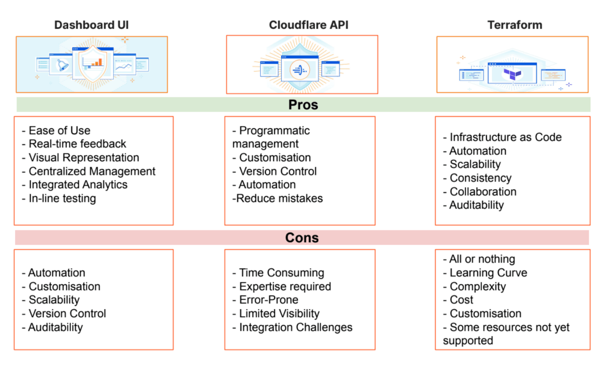

#### Infrastructure as Code (IaC) Options

Automate deployments, configuration changes, and rollbacks using these tools:

- [Cloudflare API](https://developers.cloudflare.com/api/)
- [SDKs](https://developers.cloudflare.com/fundamentals/api/reference/sdks/)
- [Terraform](https://developers.cloudflare.com/terraform/)
  - For external scripts / uncovered resources, use [external](https://registry.terraform.io/providers/hashicorp/external/latest/docs/data-sources/external).
  - If you're planning to change from Dashboard UI to Terraform, use [cf-terraforming](https://github.com/cloudflare/cf-terraforming).
- [Pulumi](https://developers.cloudflare.com/pulumi/)

> Note the [API rate limits](https://developers.cloudflare.com/fundamentals/api/reference/limits/).

#### User Access Management

Implement least-privilege access control following these best practices:

##### Role-Based Access Control (RBAC)

Cloudflare provides predefined [roles](https://developers.cloudflare.com/fundamentals/manage-members/roles/) with specific permission sets:

- **Super Administrator** - Full account access (limit to 2-3 users)
- **Administrator** - Most administrative functions except billing and membership
- **Domain-specific roles** - Scoped to individual zones:
  - DNS Administrator
  - Firewall Administrator
  - Cache Administrator
  - Analytics Administrator

> **Important**: API permissions differ from Dashboard permissions. Review [API token permissions](https://developers.cloudflare.com/api/resources/accounts/subresources/roles/methods/get/) separately.

##### User Groups

[User Groups](https://developers.cloudflare.com/fundamentals/manage-members/user-groups/) enable scalable permission management:

- Create groups based on teams or functions (e.g., "DevOps Team", "Security Team")
- Assign multiple IAM policies to each group
- Add users to groups instead of managing individual permissions
- Automatic permission inheritance for group members

#### Authentication Security

**Multi-Factor Authentication (MFA)**

- [Enforce MFA](https://developers.cloudflare.com/fundamentals/user-profiles/2fa/) for all users
- Support for TOTP apps
- Support for passkeys / [security keys](https://developers.cloudflare.com/fundamentals/user-profiles/2fa/#security-keys)
- Backup codes for recovery scenarios

**Single Sign-On (SSO)**

- [Configure SSO](https://developers.cloudflare.com/cloudflare-one/applications/configure-apps/dash-sso-apps/) with SAML or OIDC providers
- Automatic user (de)provisioning with [SCIM](https://developers.cloudflare.com/fundamentals/account/account-security/scim-setup/)

##### API Token Management

Use [Account-Owned Tokens](https://developers.cloudflare.com/fundamentals/api/get-started/account-owned-tokens/) for processes or services:

- Create service accounts for CI/CD pipelines
- Implement token rotation policies (i.e. 90-day maximum)
- Scope tokens to minimum required permissions
- Use separate tokens for different environments
- Store tokens in secure vaults

#### Monitoring and Compliance

##### Audit Logging

Monitor [Audit Logs](https://developers.cloudflare.com/fundamentals/account/account-security/audit-logs/) for:

- User login events and MFA usage
- Permission changes and role assignments
- API token creation / deletion
- Configuration modifications
- Failed authentication attempts

Export audit logs via:

- [Logpush](https://developers.cloudflare.com/logs/logpush/) to SIEM platforms (Splunk, Datadog, Elastic)
- [API](https://developers.cloudflare.com/fundamentals/account/account-security/audit-logs/#access-audit-logs) for custom integrations

##### Access Reviews

Establish regular review cycles:

- **Quarterly**: Review Super Administrator and Administrator assignments
- **Monthly**: Audit API tokens and remove unused ones
- **Weekly**: Check audit logs for anomalous activity
- **Automated**: Alert on privilege escalations or new user additions

##### Compliance Considerations

- Document role assignments for SOC 2, ISO 27001 compliance
- Implement separation of duties
- Maintain access control matrices
- Regular attestation of user access rights

#### Best Practices Summary

1. **Principle of Least Privilege**: Start with minimal permissions and add as needed
2. **Use Groups**: Manage permissions via groups, not individual users
3. **Automate Everything**: Use IaC for reproducible configurations
4. **Token Hygiene**: Rotate API tokens regularly, use scoped permissions
5. **Monitor Continuously**: Set up alerts for suspicious activities
6. **Document Policies**: Maintain runbooks for onboarding/offboarding
7. **Regular Audits**: Schedule periodic access reviews
8. **Emergency Access**: Define break-glass procedures for incidents

For advanced scenarios, consider implementing:

- Build your own custom RBAC using [Cloudflare Workers](https://developers.cloudflare.com/workers/) as an authentication and authorization gateway-layer for fine-grained access control
- Integration with identity governance platforms
- Automated compliance reporting using the [GraphQL Analytics API](https://developers.cloudflare.com/workers/tutorials/automated-analytics-reporting/)

> _**Note**: these are non-exhaustive resources and a generalization of proper user and account management practices. Follow industry-standards and implement appropriate procedures within your organization._

---

### **Origin Server Protection**

Generally, it's recommended to properly secure and manage your origin servers.

> When migrating to Cloudflare, it's highly recommended to rotate Origin Server IPs and [proxy](https://developers.cloudflare.com/dns/manage-dns-records/reference/proxied-dns-records/) all DNS records.

There's a variety of different ways and options explained on the Developer Documentation to [protect your origin server](https://developers.cloudflare.com/fundamentals/basic-tasks/protect-your-origin-server/), as well as [prepare for surges or spikes in web traffic](https://developers.cloudflare.com/fundamentals/basic-tasks/preparing-for-surges-or-spikes-in-web-traffic/) for seasonal events, such as during holidays or product launches.

> _**Note**: Review the [Post-Quantum Cryptography (PQC)](https://developers.cloudflare.com/ssl/post-quantum-cryptography/) documentation._

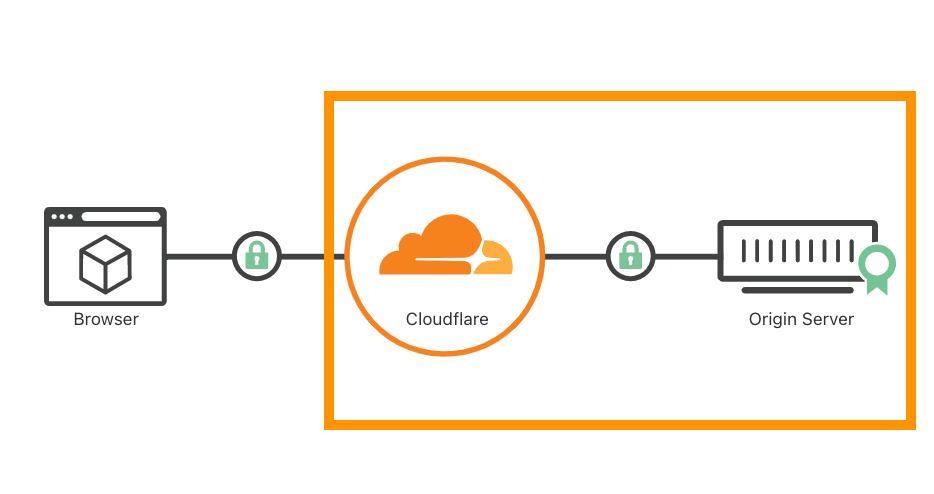

Additionally, review and enable the [available Managed Transforms](https://developers.cloudflare.com/rules/transform/managed-transforms/reference/) options to add some bot protection headers, remove "X-Powered-By” headers, or even create your own Content Security Policy (CSP) with the [Transform Rules](https://developers.cloudflare.com/rules/transform/).

Reference: [Encryption modes](https://developers.cloudflare.com/ssl/origin-configuration/ssl-modes/).

---

## HTTP/S Use Cases

### Fighting Automated Requests (Bots)

A general goal is protecting against automated requests and bots – though there are different [types of bot attacks](https://www.cloudflare.com/learning/bots/what-is-a-bot-attack/) and often it's about fraud detection or solving one of these use cases:

- Credential / Credit Card Stuffing
- Content Scraping
- Inventory Hoarding
- Account Takeover (ATO)
- Fake Account Creation
- Content Spam

The best approach to combating bots depends on the Cloudflare features available and configured, as well as the specific types of bot attacks being observed. [DDoS attacks](https://blog.cloudflare.com/ddos-threat-report-for-2024-q4/) are usually also launched by botnets. Every website is unique, and often so are the attack patterns it faces. In general, fighting bots is a _cat-and-mouse game_, requiring continuous adaptation to evolving threats. Cloudflare continuously enhances its capabilities based on [customer feedback](https://developers.cloudflare.com/bots/concepts/feedback-loop/) and its [Threat Intelligence](https://www.cloudflare.com/threat-intelligence/) to try to stay ahead.

#### Wanted vs. Unwanted Automation

The goal is not to _"block all bots"_. The goal is to **allow useful automation, constrain ambiguous automation, and stop abusive automation**. Cloudflare's own framing is that the important distinction is often **what the traffic is doing**, not simply whether it is a bot or a human: see [Moving past bots vs. humans](https://blog.cloudflare.com/past-bots-and-humans/).

[Cloudflare Verified Bots](https://developers.cloudflare.com/bots/concepts/bot/#verified-bots) are automated services Cloudflare has identified as generally useful or expected, such as search-engine crawlers and monitoring services. Verified does **not** automatically mean _"desired everywhere"_. For example, a search crawler may be allowed on public content but should usually not be allowed to crawl login, checkout, account, admin, or API mutation endpoints unless there is a specific business reason.

| Traffic class | Examples | Default posture | Cloudflare controls |
| --- | --- | --- | --- |
| Wanted verified bots | Googlebot, Bingbot, social previews, approved monitoring | Skip **only where the business wants this traffic** | [Verified Bots](https://developers.cloudflare.com/bots/concepts/bot/#verified-bots), WAF Skip rules for narrow paths, customer-managed allowlists for owned systems |
| Declared AI/search/content crawlers | Known AI/search crawlers and content consumers | Allow, block, or constrain based on content/business policy | [Detection IDs](https://developers.cloudflare.com/bots/additional-configurations/detection-ids/), [AI Crawl Control](https://developers.cloudflare.com/ai-crawl-control/), [Bot Preference Sync](https://blog.cloudflare.com/bot-preference-sync/), [BotBase for Operators](https://blog.cloudflare.com/botbase-for-operators/), robots.txt |
| User-directed agents | Browser or assistant traffic acting on behalf of a real user | Prefer risk-based controls; avoid blanket blocking when behavior is legitimate | [Bot Management variables](https://developers.cloudflare.com/bots/reference/bot-management-variables/), [Turnstile](https://developers.cloudflare.com/turnstile/), [Clearance / pre-clearance](https://developers.cloudflare.com/cloudflare-challenges/concepts/clearance/), application-layer step-up |
| Unknown automation | curl, Python requests, commodity headless browsers, suspicious TLS/browser fingerprints | Baseline → challenge/rate-limit → block if abusive | [Bot Score](https://developers.cloudflare.com/bots/reference/bot-management-variables/), [JavaScript Detections](https://developers.cloudflare.com/bots/reference/javascript-detections/), JA3/JA4 fields, [WAF Custom Rules](https://developers.cloudflare.com/waf/custom-rules/), [Rate Limiting Rules](https://developers.cloudflare.com/waf/rate-limiting-rules/) |
| Malicious fraud bots | Credential stuffing, carding, fake signups, scraper farms, inventory abuse | Block, rate-limit, challenge, or route to origin fraud workflow | [Account takeover Detection IDs](https://developers.cloudflare.com/bots/additional-configurations/detection-ids/account-takeover-detections/), [Leaked Credentials Detection](https://developers.cloudflare.com/waf/detections/leaked-credentials/), [Turnstile Ephemeral IDs](https://developers.cloudflare.com/turnstile/tutorials/fraud-detection-with-ephemeral-ids/), [API Shield](https://developers.cloudflare.com/api-shield/security/) |

Important distinctions:

- **Verified bot** means Cloudflare recognizes the bot category/operator. It does not mean every request from that bot is business-approved for every endpoint.
- **Low Bot Score** is a risk signal, not a complete fraud verdict. Stronger actions should combine Bot Score with endpoint sensitivity, method, velocity, Detection IDs, JA3/JA4, leaked credentials, session/user context, and business impact.
- **User-Agent is not identity.** It is easy to spoof. Prefer Cloudflare-provided bot signals, request behavior, cryptographic or verified signals where available, and application context.

#### Layered Mitigation Approach

To effectively mitigate bot traffic, consider the following (non-exhaustive) layered-security approach:

- Allow ([skip](https://developers.cloudflare.com/waf/custom-rules/skip/)) [Verified Bots](https://developers.cloudflare.com/bots/concepts/bot/#verified-bots) or [Verified Bot Categories](https://developers.cloudflare.com/bots/concepts/bot/verified-bots/categories/).
- Allow ([skip](https://developers.cloudflare.com/waf/custom-rules/skip/)) your `sitemap.xml`, `robots.txt` and RSS feed (if applicable) to everyone.
- Block or mitigate unwanted bots (i.e. [AI bots](https://developers.cloudflare.com/bots/concepts/bot/#ai-bots)) by leveraging [Bot Management fields](https://developers.cloudflare.com/bots/reference/bot-management-variables/) in combination with other security controls, solutions (i.e. [Snippets](https://developers.cloudflare.com/rules/snippets/when-to-use/)) and [fields](https://developers.cloudflare.com/ruleset-engine/rules-language/fields/reference/).
  - Example [honeypot for bots](https://developers.cloudflare.com/rules/snippets/examples/bots-to-honeypot/).
- Enable [JavaScript Detections (JSD)](https://developers.cloudflare.com/bots/reference/javascript-detections/#enable-javascript-detections) and [enforce](https://developers.cloudflare.com/bots/reference/javascript-detections/#enforcing-execution-of-javascript-detections) them if possible.
  - If enforcement isn't feasible (i.e. for native mobile apps), consider implementing [Turnstile](https://developers.cloudflare.com/turnstile/) (in [WebView](https://developers.cloudflare.com/turnstile/get-started/mobile-implementation/) for mobile) alongside the [WAF](https://developers.cloudflare.com/turnstile/tutorials/integrating-turnstile-waf-and-bot-management/) or Cloudflare's new mobile SDK (Enterprise feature), which can be combined with [API Shield JWT Validation](https://developers.cloudflare.com/api-shield/security/jwt-validation/) at the edge or programmatically with [Snippets](https://developers.cloudflare.com/rules/snippets/examples/jwt-validation/).
- Analyze heuristics using [Security Analytics](https://developers.cloudflare.com/waf/analytics/security-analytics/) and available [fields](https://developers.cloudflare.com/ruleset-engine/rules-language/fields/reference/) to build WAF Custom Rules based on your needs and signals.
  - Deploy the [WAF Managed Rules](https://developers.cloudflare.com/waf/managed-rules/) regularly updated security rules.
  - For important endpoints, we also recommend [WAF Attack Score](https://developers.cloudflare.com/waf/detections/attack-score/) enforcement.
- Identify ASN patterns and block unwanted traffic from certain networks or cloud providers (i.e. [AWS or GCP](https://radar.cloudflare.com/bots))l if no legitimate traffic is expected from them.
  - Use [Managed IP Lists](https://developers.cloudflare.com/waf/tools/lists/managed-lists/#managed-ip-lists) for dynamic mitigations.
  - Use ([Body](https://developers.cloudflare.com/ruleset-engine/rules-language/fields/reference/http.request.body.raw/)) [Payload Inspection](https://developers.cloudflare.com/waf/managed-rules/payload-logging/) to perform more detailed mitigations.
- Apply [Rate Limiting](https://developers.cloudflare.com/waf/rate-limiting-rules/) based on IP and other [characteristics](https://developers.cloudflare.com/waf/rate-limiting-rules/parameters/#with-the-same-characteristics) to prevent abuse and credential stuffing attacks.
  - This is often combined with [Leaked Credentials Detection](https://developers.cloudflare.com/waf/detections/leaked-credentials/).
- For APIs, implement a positive security model with [API Shield](https://developers.cloudflare.com/api-shield/), including [Schema Validation](https://developers.cloudflare.com/api-shield/security/schema-validation/) and [Sequence Mitigation](https://developers.cloudflare.com/api-shield/security/sequence-mitigation/).
  - Alternatively, one can use [Sequence Rules](https://developers.cloudflare.com/bots/concepts/sequence-rules/) (or also called _Cookie-based Sequences_) to track and enforce the order of requests a user has made and the time between requests.
- [Caching](https://developers.cloudflare.com/cache/concepts/default-cache-behavior/) anything possible (non-user-specific content) can also help reduce the load and resources of the origin servers.
- Cloudflare is gradually rolling out Fraud Detection features, such as [disposable email checks](https://blog.cloudflare.com/cloudflare-security-posture-management/).
- Additional bot-related configurations can be adjusted by Cloudflare's Bot Team on a case-by-case basis when talking to the Support Team.

Some additional interesting methods include:

- [Delay action](https://developers.cloudflare.com/bots/concepts/bot-score/delay-action/)
- [Send suspect bots to a honeypot](https://developers.cloudflare.com/rules/snippets/examples/bots-to-honeypot/)
- [price scraping](https://developers.cloudflare.com/turnstile/reference/workers-templates/price-scraping/)
- [Turnstile with Workers](https://developers.cloudflare.com/workers/examples/turnstile-html-rewriter/)
- [Data loss prevention](https://developers.cloudflare.com/workers/examples/data-loss-prevention/)
- Forward specific HTTP Request Headers with [Managed Transforms](https://developers.cloudflare.com/rules/transform/managed-transforms/reference/#add-bot-protection-headers) Rules for the origin to act on.

---

## Non-HTTP/S Use Cases

There are scenarios where users might want to leverage Cloudflare's global network and robust [L3/L4 DDoS protection](https://developers.cloudflare.com/ddos-protection/about/attack-coverage/) without handling TLS termination or processing HTTP/S traffic and payloads. For these specialized use cases, Cloudflare offers several options tailored to non-HTTP/S requirements.

Available Options:

1. **[Grey-Clouded DNS Records](https://developers.cloudflare.com/dns/manage-dns-records/reference/proxied-dns-records/#dns-only-records)**  
   This involves setting a DNS record to "DNS Only" mode. However, this approach is **not recommended**, as it exposes the origin server's IP address, compromising security.

2. **[Spectrum](https://developers.cloudflare.com/spectrum/)**  
   A powerful TCP/UDP proxy solution that supports various non-HTTP/S protocols.

   - It is typically recommended to enable [Proxy Protocol](https://developers.cloudflare.com/spectrum/how-to/enable-proxy-protocol/).
   - To avoid unintended handling of TLS, ensure the [Edge TLS Termination](https://developers.cloudflare.com/spectrum/reference/configuration-options/#edge-tls-termination) option is disabled.

3. **[Privacy Gateway](https://developers.cloudflare.com/privacy-gateway/)**  
   Privacy Gateway uses the **Oblivious HTTP (OHTTP)** standard to hide client IPs during backend interactions. Acting as a trusted relay, it forwards encrypted messages between clients and servers without accessing their content, ensuring enhanced privacy and anonymity.

4. **[Magic Transit](https://developers.cloudflare.com/magic-transit/)**  
   Operating at the network layer, Magic Transit offers advanced DDoS protection and traffic management without TLS termination.
   - For a deeper dive, check out the [Magic Transit Reference Architecture](https://developers.cloudflare.com/reference-architecture/architectures/magic-transit/).

### Additional Resources

For more guidance on avoiding Cloudflare TLS termination and decryption, visit the [Cloudflare Data Localization FAQ](https://developers.cloudflare.com/data-localization/faq/#are-there-other-options-if-i-prefer-not-to-have-cloudflare-handle-tls-termination-decryption).

## Performance Matters Too!

For application performance recommendations, see: [General Application Performance Recommendations](/articles/cloudflare-l7-performance-recommendations/).

---

## Disclaimer

Educational purposes only.

This blog post is independently created and is not affiliated with, endorsed by, or necessarily representative of the views or opinions of any organizations or services mentioned herein.

The images used in this article primarily consist of screenshots from the Cloudflare Dashboard or other publicly available materials, such as Cloudflare webinar slides.

The guidelines provided in this post are intended for general educational purposes. They should be customized to fit your specific use cases and traffic patterns. You are responsible for configuring settings according to your unique requirements, and it is important to understand their potential impact. Familiarity with Cloudflare concepts such as [WAF Phases](https://developers.cloudflare.com/waf/reference/phases/), [Proxy Status](https://developers.cloudflare.com/dns/manage-dns-records/reference/proxied-dns-records/), and other relevant features is recommended.

The author of this post is not responsible for any misconfigurations, errors, or unintended consequences that may arise from implementing the guidelines or recommendations discussed herein. You assume full responsibility for any actions taken based on this content and for ensuring that configurations are appropriate for your specific environment.

For additional learning resources, explore the following:

- [Learning Paths](https://developers.cloudflare.com/learning-paths/)
- [Enterprise Customer Portal](https://www.cloudflare.com/ecp/overview/) (for Enterprise customers)
- [Security Center](https://developers.cloudflare.com/security-center/)

For tailored support, and in general, if you have any questions or need assistance, please [contact Cloudflare support](https://developers.cloudflare.com/support/contacting-cloudflare-support/#methods-of-contacting-cloudflare-support), or (also for non-customers) call the [Under Attack (UA) Hotline](https://www.cloudflare.com/under-attack-hotline/) in emergency situations.
