Cloudflare's analytics, logs and traces used to live in several places, and many of them changed in late September 2026 during Cloudflare's Birthday Week: a unified [Logs](https://developers.cloudflare.com/observability/logs/) view, [Cloudflare Traces](https://developers.cloudflare.com/observability/traces/) (open beta), a unified [SQL API](https://developers.cloudflare.com/analytics/sql-api/), [Custom Alerts](https://developers.cloudflare.com/notifications/notification-available/#custom-alerts-beta) (beta), and [Logpush](https://developers.cloudflare.com/logs/logpush/) on every plan.

This post is a map: which tool answers which question, and where to find it. Beta features can change; when this page and the [docs](https://developers.cloudflare.com/observability/) disagree, the docs win.

---

## The Map

| **I WANT TO…** | **GO TO** | **NOTES** |
| --- | --- | --- |
| See traffic, cache, origin and DNS trends for a domain | Domain > **Analytics** (Requests, Visitors, Performance, Security, Cache, Origin, DNS) | Sampled. At least [30 days on every plan](https://developers.cloudflare.com/changelog/post/2026-10-02-30-days-analytics-on-every-plan/). |
| See analytics across all domains | **Observability** > **Analytics** | Account level. |
| See every request, unsampled | Observability > **Logs** ([select Log Explorer dataset](https://developers.cloudflare.com/log-explorer/)) | Paid add-on. Data only from when a dataset is enabled. |
| Know why a request was blocked, rewritten or slow | [Log Explorer](https://developers.cloudflare.com/log-explorer/log-search/), [Cloudflare Traces](https://developers.cloudflare.com/observability/traces/), [Security Events](https://developers.cloudflare.com/waf/analytics/security-events/) | Find specific Requests by [Ray ID](https://developers.cloudflare.com/fundamentals/reference/http-headers/#cf-ray). |
| Debug a Worker | **Compute** > Workers & Pages > your Worker > **Observability** | [Logs](https://developers.cloudflare.com/workers/observability/logs/workers-logs/), [traces](https://developers.cloudflare.com/workers/observability/traces/) and [Issues](https://developers.cloudflare.com/workers/observability/issues/). Alternatively, use [Local Explorer](https://blog.cloudflare.com/cf-cli-local-explorer/#local-explorer-what-you-can-do-remotely-you-can-now-do-locally). |
| Investigate Zero Trust users and devices | **Zero Trust** > **Insights & Logs** | [Logs](https://developers.cloudflare.com/cloudflare-one/insights/logs/), [Analytics](https://developers.cloudflare.com/cloudflare-one/insights/analytics-overview/), [Digital experience (DEX)](https://developers.cloudflare.com/cloudflare-one/insights/dex/); incl. [MCP Server for DEX](https://blog.cloudflare.com/ai-troubleshoot-warp-and-network-connectivity-issues/). |
| Query from code, a Worker or an agent | [SQL API](https://developers.cloudflare.com/analytics/sql-api/), `cf sql query`, [Workers binding](https://developers.cloudflare.com/analytics/sql-api/workers-binding/), [GraphQL API](https://developers.cloudflare.com/analytics/graphql-api/) | One SQL dialect across analytics and logs. See [Query from Code](#query-from-code-sql-api-and-graphql). |
| Get alerted on my own metric | [Custom Alerts](https://developers.cloudflare.com/notifications/notification-available/#custom-alerts-beta) | Threshold, anomaly or SLO on a SQL query. |
| Send logs to a SIEM or bucket | [Logpush](https://developers.cloudflare.com/logs/logpush/), [OpenTelemetry export](https://developers.cloudflare.com/observability/export/) | Logpush is now available on all plans. Cannot backfill. |
| See who changed a setting | [Audit Logs](https://developers.cloudflare.com/fundamentals/account/account-security/audit-logs/) | Also queryable as `audit_logs_v2` in Log Explorer. |
| Check what I will be billed | **Manage Account** > **Billing** > [Billable Usage](https://developers.cloudflare.com/billing/manage/billable-usage/) | Pay-as-you-go accounts. See [Usage vs. Billed Usage](#usage-vs-billed-usage). |

**Analytics are usually sampled, logs are not.** Dashboards, GraphQL and the SQL API's `events.*` datasets use [adaptive sampling](https://developers.cloudflare.com/analytics/graphql-api/sampling/) and are right for trends; their counts and sums are already sample-weighted estimates. Log Explorer datasets (`logs.*` in the SQL API) keep every event and are right for exact counts or a single request (depending on your configured [filters](https://developers.cloudflare.com/log-explorer/log-search/#use-log-explorer)). Traces are [head-sampled](https://developers.cloudflare.com/observability/traces/configuration/#head-sampling) at the rate you set.

---

## Post-Quantum (PQC) Usage

| **QUESTION** | **WHERE** |
| --- | --- |
| How much of my visitor traffic uses post-quantum key agreement? | Observability > **Logs** (select `http_requests` Log Explorer dataset) > field [`ClientTLSKeyExchangeGroup`](https://developers.cloudflare.com/changelog/post/2026-08-20-pqc-key-exchange-visibility/) |
| Does Cloudflare reach my origin with post-quantum key agreement? | [`OriginTLSKeyExchangeGroup`](https://blog.cloudflare.com/post-quantum-visibility/#visibility-to-origins-and-more) in the `http_requests` [Logpush](https://developers.cloudflare.com/logs/logpush/) dataset |
| Does a given host support it? What is global adoption? | [Cloudflare Radar](https://radar.cloudflare.com/post-quantum) host test and statistics, also via the [Radar API](https://developers.cloudflare.com/api/resources/radar/subresources/post_quantum/) |
| Which Cloudflare products are post-quantum today? | [PQC in Cloudflare products](https://developers.cloudflare.com/ssl/post-quantum-cryptography/pqc-cloudflare-products/), including the Cloudflare One Client, Mesh, Tunnel, IPsec and Gateway |

Field values: `X25519MLKEM768` is post-quantum (`X25519Kyber768Draft00` is its [obsolete](https://developers.cloudflare.com/ssl/post-quantum-cryptography/) draft predecessor and still shows up from older clients); `X25519`, `P-256` or another named group is classical; `UNK` means unknown (on the origin field, also no origin connection, such as a cache hit); `NONE` means RSA key exchange or no TLS.

Per-zone share in Log Explorer:

```sql
SELECT ClientTLSKeyExchangeGroup, COUNT(*) AS requests
FROM http_requests
GROUP BY ClientTLSKeyExchangeGroup
ORDER BY requests DESC
LIMIT 10
```

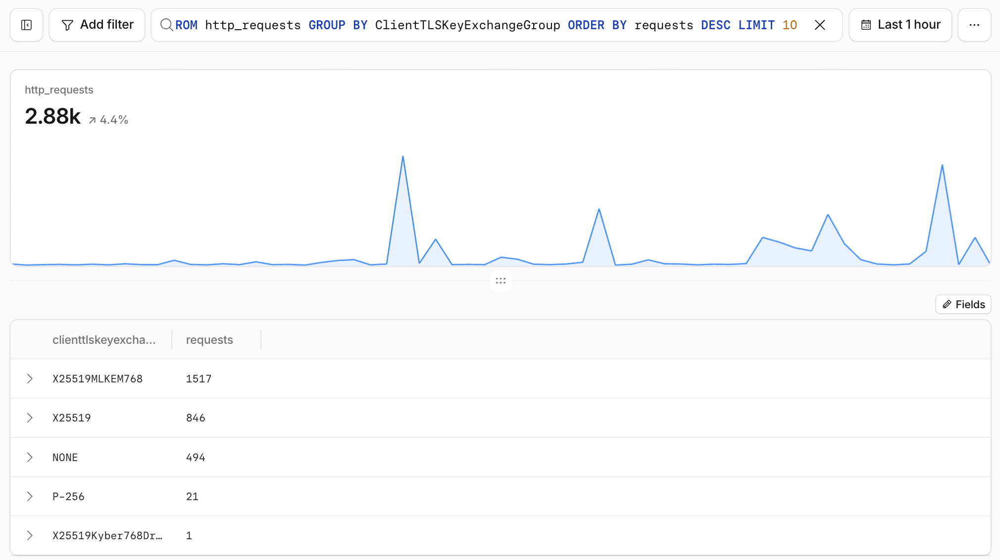
_<small>Cloudflare dashboard, **Observability** > **Logs**: `http_requests` grouped by `ClientTLSKeyExchangeGroup`.</small>_

The dashboard's time picker sets the time range, and the chart shows the dataset's event volume over it; the query result is the table below the chart. Through the API, add a `date` filter, as in the `curl` example further below.

Add `ClientRequestUserAgent` to the `GROUP BY` and filter out `X25519MLKEM768` to find which clients still negotiate classical key exchange. For the origin leg, run the same aggregation on `OriginTLSKeyExchangeGroup` in your Logpush destination, excluding `'UNK'`. Background on the algorithms: [Post-Quantum Cryptography (PQC)](/articles/post-quantum-cryptography-pqc/).

---

## CDN Usage: Requests and Data Transfer

For trends, Domain > **Analytics** > **Requests** is enough.

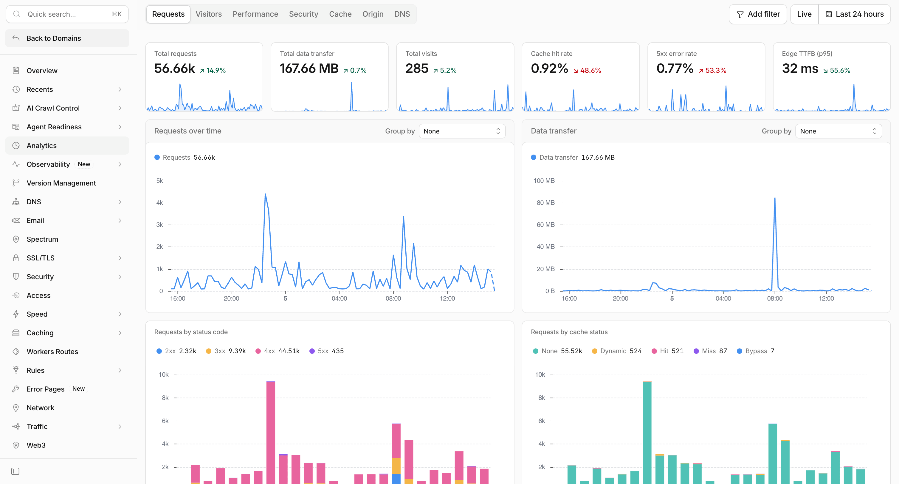
_<small>Cloudflare dashboard, domain **Analytics** > **Requests** tab (sampled).</small>_

For more exact numbers, query the unsampled `http_requests` dataset in Log Explorer:

```sql
SELECT
  COUNT(*) AS total_requests,
  SUM(EdgeResponseBytes) AS total_data_transfer_bytes,
  SUM(EdgeResponseBytes) / (1024.0 * 1024.0 * 1024.0) AS total_data_transfer_gib,
  SUM(EdgeResponseBytes) / (1024.0 * 1024.0) AS total_data_transfer_mib
FROM http_requests
WHERE clientrequestsource = 'eyeball'
```

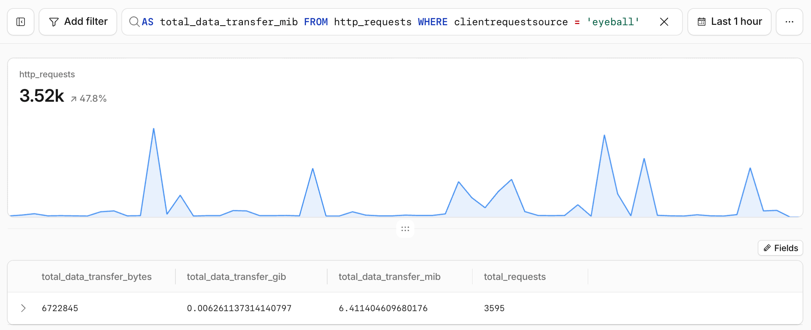
_<small>Cloudflare dashboard, **Observability** > **Logs**: CDN usage query on `http_requests`, end-user traffic only (unsampled).</small>_

Or run it through the [Log Explorer API](https://developers.cloudflare.com/log-explorer/api/):

```bash
curl "https://api.cloudflare.com/client/v4/zones/{zone_id}/logs/explorer/query/sql" \
  --header "Authorization: Bearer <API_TOKEN>" \
  --url-query query="SELECT COUNT(*) AS total_requests, SUM(EdgeResponseBytes) AS total_bytes FROM http_requests WHERE date >= '2026-09-01' AND date <= '2026-09-30' AND ClientRequestSource = 'eyeball'"
```

Read the result correctly:

- **Count end users only.** [`ClientRequestSource`](https://developers.cloudflare.com/logs/reference/clientrequestsource/) separates `eyeball` requests from Cloudflare-generated ones such as `edgeWorkerFetch`, `inBrowserChallenge`, `imageResizing` or `healthcheck`; the docs recommend filtering on `eyeball` to count end-user requests.
- **Bytes.** `EdgeResponseBytes` is what the edge returned to the client; `EdgeResponseBodyBytes` is the body alone. Dividing by 1024³ gives GiB; divide by 10⁹ for decimal GB.
- **Coverage.** Log Explorer only holds events from the moment a dataset was enabled, and only the fields and filters chosen at ingestion. The [default ingestion filter](https://developers.cloudflare.com/log-explorer/faq/#are-logs-from-attack-traffic-included-in-my-log-explorer-usage) drops L7 DDoS events (`SecuritySources` contains `l7ddos`).
- **Time range.** In **Observability** > **Logs**, the time picker scopes the query. Through the API, add a `date` (`YYYY-MM-DD`) filter as in the `curl` example; without one, the query scans everything retained. A timestamp-only filter also works but is slower on large zones.

### More Log Explorer Queries

Cloudflare's [example queries](https://developers.cloudflare.com/log-explorer/example-queries/) cover security actions, challenged IPs, bandwidth by URI, round-trip time by country, cache status and slow paths. Three worth keeping, slightly tightened:

Cache effectiveness for end users:

```sql
SELECT
  CacheCacheStatus,
  COUNT(*) AS requests,
  SUM(EdgeResponseBytes) AS total_bytes,
  AVG(EdgeTimeToFirstByteMs) AS avg_ttfb_ms
FROM http_requests
WHERE ClientRequestSource = 'eyeball'
GROUP BY CacheCacheStatus
ORDER BY requests DESC
```

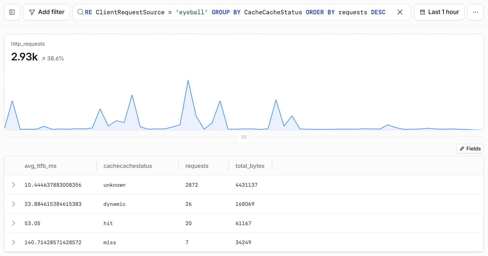
_<small>Cloudflare dashboard, **Observability** > **Logs**: requests, bytes and average TTFB per cache status.</small>_

Top URIs by data transfer. Divide by `1024.0`, not `1024`, or the result is truncated to whole MiB:

```sql
SELECT
  ClientRequestURI,
  COUNT(*) AS requests,
  SUM(EdgeResponseBytes) / (1024.0 * 1024.0) AS mib_transferred
FROM http_requests
WHERE ClientRequestSource = 'eyeball'
GROUP BY ClientRequestURI
ORDER BY mib_transferred DESC
LIMIT 10
```

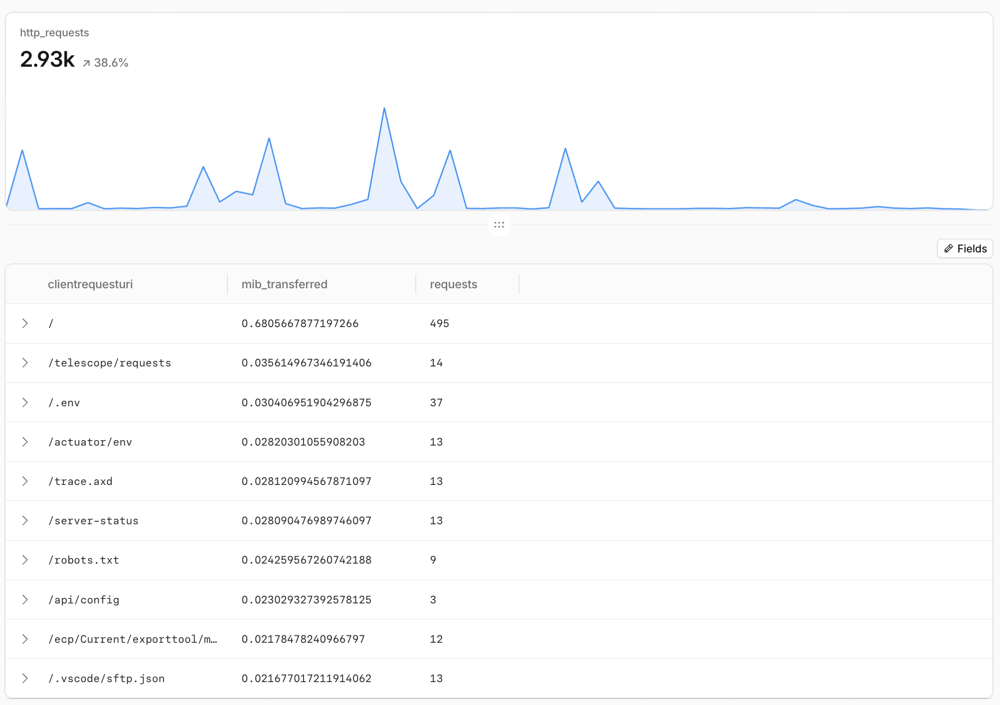
_<small>Cloudflare dashboard, **Observability** > **Logs**: top URIs by data transfer, in MiB.</small>_

Slowest paths. `HAVING` stops paths with one or two slow requests from topping the list:

```sql
SELECT
  ClientRequestPath,
  COUNT(*) AS requests,
  AVG(EdgeTimeToFirstByteMs) AS avg_ttfb_ms,
  SUM(CASE WHEN EdgeResponseStatus >= 500 THEN 1 ELSE 0 END) AS errors_5xx
FROM http_requests
WHERE ClientRequestSource = 'eyeball'
GROUP BY ClientRequestPath
HAVING COUNT(*) >= 100
ORDER BY avg_ttfb_ms DESC
LIMIT 10
```

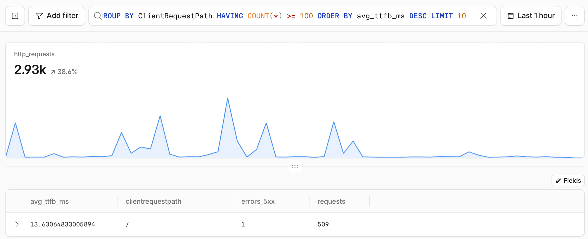
_<small>Cloudflare dashboard, **Observability** > **Logs**: slowest paths with at least 100 requests.</small>_

---

## Query from Code: SQL API and GraphQL

Everything above also works from scripts, notebooks, Workers and agents. Two APIs cover most of it.

### SQL API

The [SQL API](https://developers.cloudflare.com/analytics/sql-api/) runs one SQL dialect over analytics (`events.*`, `states.*`) and logs (`logs.*`, including your Log Explorer datasets). Every query needs an account or zone scope, a lower time bound and exactly one dataset.

Look datasets up instead of guessing their names. The [introspection endpoint](https://developers.cloudflare.com/analytics/sql-api/datasets/#discover-datasets) lists what your account can query, with each dataset's category and sampling; Log Explorer and Workers Analytics Engine datasets only appear where you have them. Add `dataset_name` and `include_columns=true` to get a dataset's [columns](https://developers.cloudflare.com/analytics/sql-api/datasets/#columns) and types:

```bash
curl --get "https://api.cloudflare.com/client/v4/analytics/sql/introspection" \
  --header "Authorization: Bearer <API_TOKEN>" \
  --data-urlencode "account_tag=<ACCOUNT_TAG>" \
  --data-urlencode "dataset_name=events.httpRequests" \
  --data-urlencode "include_columns=true"
```

The `cf` CLI covers both steps: `cf sql datasets --account-tag <ACCOUNT_TAG>`, then `cf sql query`.

### GraphQL Analytics API

The [GraphQL Analytics API](https://developers.cloudflare.com/analytics/graphql-api/) has a dynamic schema with more than 70 datasets. Explore it with [introspection](https://developers.cloudflare.com/analytics/graphql-api/features/discovery/introspection/), most easily in the [GraphQL API Explorer](https://developers.cloudflare.com/analytics/graphql-api/getting-started/explore-graphql-schema/), or with a query such as this one, which lists the dimensions of account-level DNS analytics:

```graphql
{
  __type(name: "AccountDnsAnalyticsAdaptiveGroupsDimensions") {
    fields { name description }
  }
}
```

The [settings](https://developers.cloudflare.com/analytics/graphql-api/features/discovery/settings/) node shows how far back, and over how long a window, each dataset can be queried for your plan.

Datasets with `Adaptive` in their name are sampled, and their `count` and `sum` fields are already estimates. Add [`confidence(level: 0.95)`](https://developers.cloudflare.com/analytics/graphql-api/features/confidence-intervals/) to get the range the true value most likely falls in:

```graphql
httpRequestsAdaptiveGroups(filter: $filter, limit: 1) {
  count
  confidence(level: 0.95) {
    count { estimate lower upper sampleSize }
  }
}
```

### Account-Wide Weekly Totals

One GraphQL request returns end-user CDN traffic trends per zone, total [account-level DNS queries](https://developers.cloudflare.com/changelog/post/2025-06-23-account-level-dns-analytics-api/) across all zones, and Workers requests and CPU time:

```graphql
query AccountWeeklyUsage(
  $accountTag: string!
  $start: Time!
  $end: Time!
  $startDate: Date!
  $endDate: Date!
) {
  viewer {
    accounts(filter: { accountTag: $accountTag }) {
      cdnByZone: httpRequestsAdaptiveGroups(
        filter: { datetime_geq: $start, datetime_lt: $end, requestSource: "eyeball" }
        limit: 10
        orderBy: [sum_edgeResponseBytes_DESC]
      ) {
        count
        sum { edgeResponseBytes }
        dimensions { zoneTag }
      }
      dnsQueries: dnsAnalyticsAdaptiveGroups(
        filter: { date_geq: $startDate, date_leq: $endDate }
        limit: 1
      ) {
        count
      }
      workers: workersInvocationsAdaptive(
        filter: { datetime_geq: $start, datetime_lt: $end }
        limit: 1
      ) {
        sum { requests cpuTimeUs }
      }
    }
  }
}
```

```json
{
  "accountTag": "<ACCOUNT_ID>",
  "start": "2026-09-28T00:00:00Z",
  "end": "2026-10-05T00:00:00Z",
  "startDate": "2026-09-28",
  "endDate": "2026-10-04"
}
```

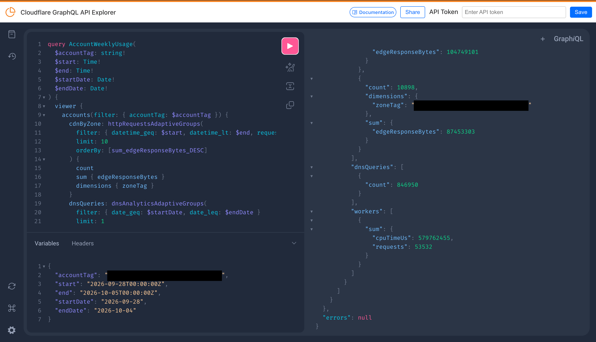
_<small>Cloudflare GraphQL API Explorer: the account-wide weekly totals query and its result; account and zone IDs redacted.</small>_

To compare several weeks in one request, repeat a field under a different alias, such as `week_2026_09_28: dnsAnalyticsAdaptiveGroups(...)` and `week_2026_09_21: dnsAnalyticsAdaptiveGroups(...)`. To split a week by day or by zone, group by the `date` or `zoneTag` dimension. `cpuTimeUs` is in microseconds; divide by 1,000 to compare it with CPU milliseconds.

### Rate Limits

All of these run on the Cloudflare API, so the [standard API rate limits](https://developers.cloudflare.com/fundamentals/api/reference/limits/) apply: 1,200 requests per five minutes per user, counted across the dashboard, API keys and API tokens. Above that, API calls return HTTP `429` for the next five minutes. On top of that:

- **GraphQL** [limits](https://developers.cloudflare.com/analytics/graphql-api/limits/): 300 queries per five minutes per user by default (cost-based, so heavy queries use the budget faster; the error reads `Rate limiter budget depleted`), up to 10 zones or 1 account per query, and per-dataset limits on time range, fields and rows. [Account-based rate limiting](https://developers.cloudflare.com/analytics/graphql-api/account-based-rate-limiting/) helps when you query many zones or accounts.
- **SQL API** [limits](https://developers.cloudflare.com/analytics/sql-api/limits/): one statement per request, `ORDER BY` needs `LIMIT`, and HTTP `429`, `503` or `507` when a query exceeds rate or resource limits. Honor `Retry-After`.

Agents and notebooks hit these limits quickly: combine questions into one GraphQL request with aliases, narrow time ranges, and back off on `429`. Enterprise customers can ask Cloudflare Support to raise the API and GraphQL limits.

---

## Usage vs. Billed Usage

Analytics and logs measure traffic. Billing applies each product's own definition of a billable unit, and [automatically excludes DDoS attack traffic](https://developers.cloudflare.com/ddos-protection/frequently-asked-questions/#does-cloudflare-charge-for-ddos-attack-traffic), so an invoice can differ from what you count yourself. The invoice is authoritative.

| **NEED** | **WHERE** | **AVAILABLE TO** |
| --- | --- | --- |
| Daily usage-based cost that matches the invoice | [Billable Usage](https://developers.cloudflare.com/billing/manage/billable-usage/) dashboard, or the [Billable Usage API](https://blog.cloudflare.com/billable-usage-api/) (`GET /accounts/{account_id}/billable-usage`, Billing Read token) | Pay-as-you-go accounts |
| An alert when total spend crosses a dollar amount | [Budget alerts](https://developers.cloudflare.com/billing/manage/budget-alerts/) | Pay-as-you-go accounts |
| An alert when one product's usage crosses a threshold | **Notifications** > **Usage Based Billing** ([usage-based billing notifications](https://developers.cloudflare.com/billing/understand/usage-based-billing/#usage-based-billing-notifications)) | Pay-as-you-go accounts |
| An alert on your own usage query | [Custom Alerts](https://developers.cloudflare.com/notifications/notification-available/#custom-alerts-beta) (beta), for example on daily `eyeball` data transfer | All plans |
| Which products are metered, and how | [Usage-based billing](https://developers.cloudflare.com/billing/understand/usage-based-billing/) | All |

The Billable Usage dashboard, API and budget alerts do not support Enterprise contracts yet. Cloudflare has said an [equivalent experience for Enterprise contracts](https://blog.cloudflare.com/billable-usage-api/#whats-next) is in the works, so Enterprise customers can expect similar functionality in the future.

What does not cost extra:

- **DDoS attack traffic.** DDoS protection has been [free, unmetered and unlimited](https://developers.cloudflare.com/ddos-protection/frequently-asked-questions/#does-cloudflare-charge-for-ddos-attack-traffic) since 2017, and Cloudflare's billing systems exclude attack traffic from your usage. Cloudflare's [Enterprise packages](https://www.cloudflare.com/plans/enterprise/externa/) put it as no "attack traffic tax": you pay for clean traffic, not the malicious requests Cloudflare blocks.
- **The `/cdn-cgi/` endpoint.** Word on the street (not officially documented) is that requests to the [Cloudflare-managed `/cdn-cgi/` endpoint](https://developers.cloudflare.com/fundamentals/reference/cdn-cgi-endpoint/), such as challenges or Web Analytics beacons, are usually excluded from billing. The exception is Images: transformations under `/cdn-cgi/image/` are billable. Confirm with your account team, and measure the share by adding `AND ClientRequestPath LIKE '/cdn-cgi/%'` to the [CDN usage query](#cdn-usage-requests-and-data-transfer).
- **Waiting in Workers.** Workers are billed for [CPU time, not duration](https://developers.cloudflare.com/workers/platform/pricing/#workers): there is no charge for wall-clock time, so a Worker waiting on a database, an API or an LLM response costs nothing while it waits. Subrequests a Worker makes and requests to static assets are not billed either.
- **Idle Durable Objects.** Durable Objects are billed differently from Workers: for [duration](https://developers.cloudflare.com/durable-objects/platform/pricing/#compute-billing), the wall-clock time an object is active (charged at 128 MB per object), including time it spends waiting on I/O. Duration stops as soon as an object is idle and eligible to hibernate, even before it is evicted from memory. The [WebSocket Hibernation API](https://developers.cloudflare.com/durable-objects/best-practices/websockets/#durable-objects-hibernation-websocket-api) is what makes an object with open WebSocket connections eligible between messages, so idle connections cost no duration. A WebSocket accepted with the standard `accept()` keeps duration running for as long as it stays connected.
- **Egress from partner clouds.** With Cloudflare as the security umbrella and connectivity cloud in front of your cloud providers, members of the [Bandwidth Alliance](https://www.cloudflare.com/bandwidth-alliance/), such as Oracle Cloud and Alibaba Cloud, discount or waive their data transfer fees for traffic to Cloudflare. [Microsoft Azure](https://developers.cloudflare.com/support/third-party-software/others/reduce-data-transfer-egress-costs-between-azure-and-cloudflare/) customers can lower egress to Cloudflare with Routing Preference. Check the partner list for your provider.

---

## Correlate One Request Across Datasets

The [Ray ID](https://developers.cloudflare.com/fundamentals/reference/cloudflare-ray-id/) is the join key in the most common cases. It is returned in the `cf-ray` response header and shown on Cloudflare error pages.

| **WHERE** | **HOW** |
| --- | --- |
| HTTP requests | [`RayID`](https://developers.cloudflare.com/logs/logpush/logpush-job/datasets/zone/http_requests/#rayid); [`ParentRayID`](https://developers.cloudflare.com/logs/faq/worker-subrequests/#how-the-two-entries-are-linked) links a Worker subrequest to its parent |
| Firewall events | [`RayID`](https://developers.cloudflare.com/logs/logpush/logpush-job/datasets/zone/firewall_events/#rayid) |
| Account Abuse Protection Events | [`RayID`](https://developers.cloudflare.com/logs/logpush/logpush-job/datasets/zone/account_abuse_protection_events/#rayid) |
| Websocket Analytics | [`RayID`](https://developers.cloudflare.com/logs/logpush/logpush-job/datasets/zone/websocket_analytics/#rayid) |
| Access requests | [`RayID`](https://developers.cloudflare.com/logs/logpush/logpush-job/datasets/account/access_requests/#rayid) |
| Cloudflare Traces | Filter on the Ray ID to open the full span tree: rules, cache, Workers, origin |
| Log Explorer | Filter on `RayID` |

```sql
SELECT
  EdgeStartTimestamp,
  RayID,
  ClientRequestHost,
  ClientRequestPath,
  EdgeResponseStatus,
  SecurityAction,
  CacheCacheStatus,
  WorkerScriptName,
  OriginResponseStatus
FROM http_requests
WHERE RayID = '<RAY_ID>'
LIMIT 1
```

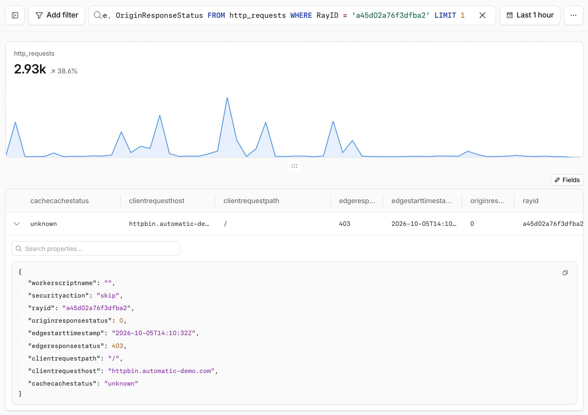
_<small>Cloudflare dashboard, **Observability** > **Logs**: one request in `http_requests`, looked up by Ray ID.</small>_

Then pivot with the same Ray ID. `firewall_events` lists every security rule that acted on the request and what it did: here, two `skip` rules; for a blocked request, the rule that blocked it.

```sql
SELECT RayID, Action, Source, RuleID, Description
FROM firewall_events
WHERE RayID = '<RAY_ID>'
LIMIT 5
```

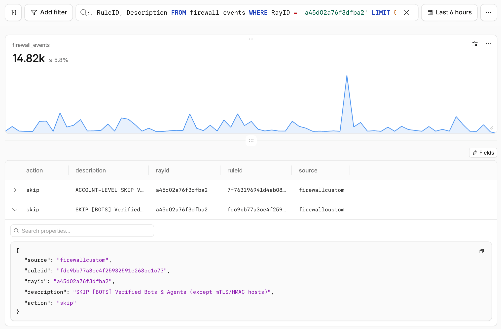
_<small>Cloudflare dashboard, **Observability** > **Logs**: the same Ray ID in `firewall_events`, with the rules that acted on it.</small>_

### Gateway HTTP and Your Zone

The [`gateway_http`](https://developers.cloudflare.com/logs/logpush/logpush-job/datasets/account/gateway_http/) dataset has **no** `RayID` field. Its identifiers are `RequestID`, `SessionID`, `DeviceID`, `UserID` and `Email`. When a user behind Gateway opens a hostname on your own zone, you get two independent records: Gateway's, and your zone's `http_requests`, where `ClientIP` is a Gateway egress IP.

Time window, hostname, path and status code are usually enough for an investigation. It is not one-to-one, though. To join the records deterministically, stamp the request:

1. Create a Gateway HTTP policy with the **Allow** action, scoped to your own domains, that [sets request headers](https://developers.cloudflare.com/cloudflare-one/traffic-policies/http-policies/tenant-control/) from dynamic values. Requires [TLS decryption](https://developers.cloudflare.com/cloudflare-one/traffic-policies/http-policies/tls-decryption/). Gateway applies the first matching Allow or Block policy, so place it after your security Block policies and before any broader Allow policy that already matches those hostnames.
2. Log the headers on each zone with [custom fields](https://developers.cloudflare.com/logs/logpush/logpush-job/custom-fields/): add `x-gateway-device` and `x-gateway-user` as request headers.
3. Query both datasets by the same value.

In the dashboard, create the policy under **Zero Trust** > **Traffic controls** > **Firewall policies** > **HTTP**, with **Modify request headers** set to **Overwrite**. With the [Gateway rules API](https://developers.cloudflare.com/api/resources/zero_trust/subresources/gateway/subresources/rules/methods/create/) (`POST /accounts/{account_id}/gateway/rules`), the request body is:

```json
{
  "name": "ALLOW Stamp Gateway IDs for Own Zones",
  "action": "allow",
  "enabled": true,
  "filters": ["http"],
  "traffic": "any(http.request.domains[*] in {\"example.com\" \"example.net\"})",
  "rule_settings": {
    "set_headers": {
      "X-Gateway-Device": ["@{device.id}"],
      "X-Gateway-User": ["@{identity.id}"]
    }
  }
}
```

`http.request.domains` matches each domain and all its subdomains. `set_headers` overwrites any value the client sends on Gateway traffic, but a request that bypasses Gateway can still carry the header: treat it as a correlation key, not as proof of identity.

```sql
SELECT Datetime, Email, DeviceID, URL, HTTPStatusCode, Action, RequestID
FROM gateway_http
WHERE DeviceID = '<DEVICE_ID>' AND Action != 'bypass'
LIMIT 100
```

`Action != 'bypass'` drops Do Not Inspect traffic, which Gateway logs without a URL or request ID and cannot stamp with headers.

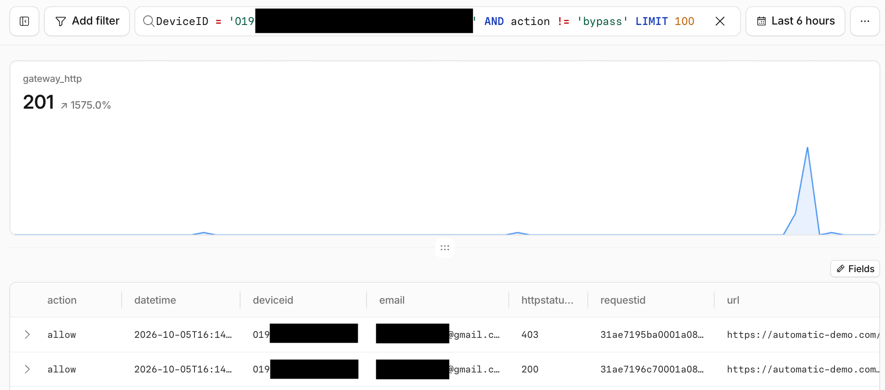
_<small>Cloudflare dashboard, **Observability** > **Logs**: `gateway_http` events for one device; device ID and email redacted.</small>_

```sql
SELECT EdgeStartTimestamp, RequestHeaders, RayID, ClientRequestHost, ClientRequestPath, EdgeResponseStatus, SecurityAction
FROM http_requests
WHERE requestheaders."x-gateway-device" = '<DEVICE_ID>'
LIMIT 100
```

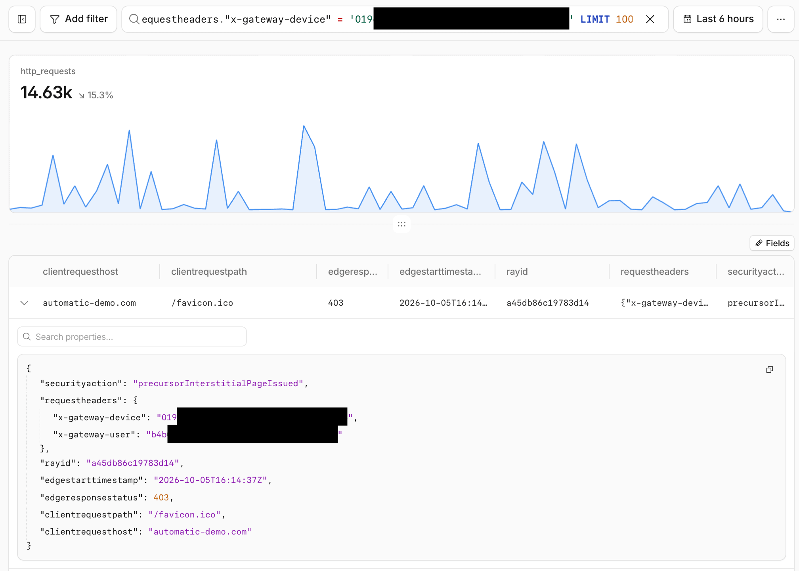
_<small>Cloudflare dashboard, **Observability** > **Logs**: the same request in the zone's `http_requests`, matched on the `x-gateway-device` header; IDs redacted.</small>_

`DeviceID` is empty for traffic that does not come through the Cloudflare One Client, such as clientless Browser Isolation. For that traffic, use the `x-gateway-user` header (the user's Cloudflare identity UUID) and compare it with the UUID in `UserID`.

Keep the policy limited to hostnames you control, so identifiers are not sent to third parties. If Gateway cannot resolve a dynamic value, it sends a placeholder such as `cf-unresolved` and adds a warning to the HTTP log.

---

## Cloudflare One Client Issues (DEX)

[Digital Experience Monitoring](https://developers.cloudflare.com/cloudflare-one/insights/dex/) is included in all Zero Trust plans. Start in **Zero Trust** > **Insights & Logs** > **Digital experience**.

| **QUESTION** | **WHERE** |
| --- | --- |
| Is it one user or everyone? | **Device overview**: connection status and devices per Cloudflare data center |
| Is it the device, the network or the app? | [Device monitoring](https://developers.cloudflare.com/cloudflare-one/insights/dex/monitoring/) and [synthetic tests](https://developers.cloudflare.com/cloudflare-one/insights/dex/tests/) (HTTP, traceroute) |
| What happened on the device? | **Diagnostics** > [remote captures](https://developers.cloudflare.com/cloudflare-one/insights/dex/diagnostics/client-packet-capture/): packet captures and device diagnostic logs (last 96 hours) from up to 10 devices (Windows, macOS, Linux) |
| What does the diagnostic log say? | Select the capture > **View Device Diag**: the diagnostics analyzer shows an AI summary, detection events and device details |
| What did Gateway do with the traffic? | **Insights & Logs** > **Logs**: DNS query logs, Network logs and HTTP request logs |
| History beyond the dashboard, or in a SIEM | Log Explorer or Logpush: `dex_application_tests`, `dex_device_state_events`, `warp_toggle_changes`, `warp_config_changes`, `device_posture_results`, `zero_trust_network_sessions`, `ssh_logs`, `mcp_portal_logs`, `biso_user_actions`, `casb_findings`, `access_requests`, `gateway_*`, `dlp_forensic_copies`, `email_security_*`, `ipsec_logs` |

Dashboard [retention](https://developers.cloudflare.com/cloudflare-one/insights/logs/#log-retention) can be short. Enable Log Explorer datasets or Logpush before you need them.

The [DEX MCP server](https://developers.cloudflare.com/cloudflare-one/insights/dex/dex-mcp-server/) answers questions such as "fetch the DEX test results for `user@example.com` over the past 24 hours". Here is a [practical example](https://blog.cloudflare.com/ai-troubleshoot-warp-and-network-connectivity-issues/).

---

## Debug Workers with AI Agents

### Locally

`wrangler dev` and `vite dev` capture [OpenTelemetry traces and correlated logs](https://developers.cloudflare.com/changelog/post/2026-08-04-local-tracing/) with no setup. Update the [Wrangler CLI](https://developers.cloudflare.com/workers/wrangler/install-and-update/) and [Vite plugin](https://developers.cloudflare.com/workers/vite-plugin/).

- **Humans:** press `e` in Wrangler, or open `/cdn-cgi/local/explorer`. [Local Explorer](https://developers.cloudflare.com/workers/local-development/local-explorer/) shows logs, traces, and the data in local KV, R2, D1, Durable Objects and Workflows.
- **Agents:** when Wrangler detects an AI agent, it prints the Local Explorer API (`/cdn-cgi/local/explorer/api`, with an OpenAPI spec). Traces and logs are queryable with SQL via `POST /cdn-cgi/local/explorer/api/local/observability/query`, so an agent can find the failing span, fix the code, rerun and verify without deploying or adding `console.log()`.

### In Production

```jsonc
{
  "observability": {
    "enabled": true,
    "logs": { "head_sampling_rate": 1 },
    "traces": { "enabled": true, "head_sampling_rate": 0.05 },
    "issues": { "enabled": true }
  }
}
```

- **[Workers Logs](https://developers.cloudflare.com/workers/observability/logs/workers-logs/)** are on by default for new Workers. Log structured JSON so fields are filterable in the [Query Builder](https://developers.cloudflare.com/workers/observability/query-builder/).
- **[Traces](https://developers.cloudflare.com/workers/observability/traces/)** instrument fetch, binding, RPC and handler calls automatically. `observability.enabled` alone does not turn them on yet.
- **[Issues](https://developers.cloudflare.com/workers/observability/issues/)** group uncaught exceptions, failed invocations, `5xx` responses and error logs (Wrangler 4.134.0+). Automations can send an issue straight to a coding agent, webhook, chat or incident tool.
- **[OpenTelemetry export](https://developers.cloudflare.com/workers/observability/opentelemetry-export/)** sends logs and traces to Honeycomb, Grafana Cloud, Axiom and others.

### Give Your Agent Access

Most people find it easier to ask "which paths returned the most 5xx errors since yesterday's deploy?" than to write the SQL or GraphQL for it. An agent writes the query, scans thousands of log lines, pivots between datasets and summarizes the pattern far faster than clicking through dashboards, and the same agent can then read the code and propose the fix. Give it read-only, narrowly scoped access, and check important numbers before acting on them.

| **TOOL** | **USE** |
| --- | --- |
| [Agent setup](https://developers.cloudflare.com/agent-setup/) | Per-agent guides (Claude Code, Codex, Cursor, …) for Cloudflare Skills and MCP servers |
| Observability MCP: `https://observability.mcp.cloudflare.com/mcp` | Workers logs and analytics |
| Code Mode MCP: `https://mcp.cloudflare.com/mcp` | The whole Cloudflare API through one server |
| [`cf` CLI](https://blog.cloudflare.com/cloudflare-cf-cli-launch/) (beta): `npm install --global cf` | JSON output by default; `cf sql query` and `cf sql datasets` |
| [Other Cloudflare MCP servers](https://developers.cloudflare.com/agents/model-context-protocol/cloudflare/servers-for-cloudflare/) | DEX, Logpush, Audit Logs, DNS Analytics, AI Gateway, Radar |

---

## Other Common Questions

| **QUESTION** | **ANSWER** |
| --- | --- |
| Why was this request blocked? | Domain > **Analytics** > **Security** tab, or the [Security Events](https://developers.cloudflare.com/waf/analytics/security-events/) for what Cloudflare acted on, or Observability > Traces for the exact rule. |
| Can I alert on my own query? | [Custom Alerts](https://developers.cloudflare.com/notifications/notification-available/#custom-alerts-beta) (beta) run a SQL API query on a schedule: threshold, anomaly or SLO. Email and webhooks on all plans, PagerDuty from Business. |
| One dashboard for CDN, WAF and Workers? | [Custom Dashboards](https://developers.cloudflare.com/analytics/custom-dashboards/) combine analytics, Log Explorer and Workers Observability logs and traces; up to 100 per account. |
| Can my app show its own analytics? | The [Analytics SQL binding](https://developers.cloudflare.com/analytics/sql-api/workers-binding/) (`ANALYTICS_SQL`, Wrangler 4.145.0+) queries the SQL API from a Worker without an API token. Log Explorer datasets are not supported through it. |
| Logs into my SIEM? | [Logpush](https://developers.cloudflare.com/logs/logpush/pricing/) on all plans. [Transformers](https://developers.cloudflare.com/logs/logpush/transformers/) filter, reshape and redact with SQL. Logpush [cannot backfill](https://developers.cloudflare.com/logs/logpush/logpush-health/), so subscribe to the **Failing Logpush Job Disabled** [alert](https://developers.cloudflare.com/logs/logpush/alerts-and-analytics/) and query job health with `logpushHealthAdaptiveGroups` in GraphQL. The billed volume (uncompressed bytes delivered) is `billableBytes` in the account-level `logpushUsageAdaptiveGroups`. |
| Usage for DNS, Images or Stream? | DNS: `dnsAnalyticsAdaptiveGroups` in GraphQL, per account or zone (see [Account-Wide Weekly Totals](#account-wide-weekly-totals)). Images: self-serve plans bill [unique transformations](https://developers.cloudflare.com/images/pricing/) per month, plus images stored and delivered; `imagesTransformationsAdaptiveGroups` and `imagesUniqueTransformationsAccumulatedSinceStartOfMonth` in GraphQL estimate them. The Images [usage statistics API](https://developers.cloudflare.com/api/resources/images/subresources/v1/subresources/stats/methods/get/) only counts stored images. Stream: minutes stored from the [storage usage API](https://developers.cloudflare.com/api/resources/stream/subresources/videos/methods/storage_usage/), minutes viewed from `streamMinutesViewedAdaptiveGroups`. |
| Usage for R2, D1 or KV? | Account-level GraphQL datasets: `r2StorageAdaptiveGroups` and `r2OperationsAdaptiveGroups` (group by `actionType` to split [Class A and B](https://developers.cloudflare.com/r2/pricing/)), `d1AnalyticsAdaptiveGroups` (`rowsRead`, `rowsWritten`) and `kvOperationsAdaptiveGroups`. Add them as aliases to the [weekly totals](#account-wide-weekly-totals) query. |
| Is Cloudflare having an incident? | [Cloudflare Status](https://www.cloudflarestatus.com/), and the [Cloudflare Status notification](https://developers.cloudflare.com/notifications/notification-available/#cloudflare-status) for email or webhook alerts. |

---

## Disclaimer

For informational purposes only. Features, availability and pricing change; the [Cloudflare documentation](https://developers.cloudflare.com/) is the reference.

Numbers from analytics, logs and the queries in this post help with monitoring and planning, but they are not billing records. Discuss billing questions directly with your Cloudflare account team or [Cloudflare Support](https://developers.cloudflare.com/support/contacting-cloudflare-support/): your invoice and Cloudflare's billing systems are authoritative.

This blog post is independent and not affiliated with, endorsed by, or necessarily reflective of the opinions of Cloudflare or any other entities mentioned. Screenshots are taken from the Cloudflare Dashboard of my own account.

This blog post was partially drafted and refined with AI assistance.
